# Introduction
Jab hum kisi bari language model ke input aur output ke baare mein sochte hain, toh ek text prompt (kabhi kabhi doosre modalities jaise tasveeri prompts ke saath) woh input hota hai jo model kisi khaas output ki prediction ke liye istemal karta hai. Aap ko data scientist ya machine learning engineer hone ki zarurat nahi – har koi prompt likh sakta hai. Lekin, sab se zyada muasar prompt banana thora mushkil ho sakta hai. Aap ke prompt ke kai pehlu uski kaamyaabi ko mutasir karte hain: aap jo model istemal karte hain, us model ka training data, model ki configurations, aap ke lafz ka chunao, andaaz aur lehja, dhancha, aur context – yeh sab ahem hain. Is liye, prompt engineering ek baar baar dohrane wala amal hai. Na kaafi prompts ghair wazeh ya ghalat jawabat ka sabab ban sakte hain, aur model ki maana khiz output dene ki salahiyat mein rukawat daal sakte hain.


Jab aap Gemini chatbot ke saath baat karte hain, aap asal mein prompts likhte hain. Lekin yeh whitepaper Gemini model ke liye prompts likhne par focus karta hai jo Vertex AI ke andar ya API ke zariye istemal hota hai, kyunki model ko seedha prompt karne se aap ko temperature jaise configurations tak rasai milti hai.
<br><br>
Yeh whitepaper prompt engineering ko tafseel se discuss karta hai. Hum mukhtalif prompting techniques dekhen ge jo aap ko shuruat karne mein madad den ge, aur tips aur behtareen amalon ka tabadla karenge taake aap prompting mein mahir ban saken. Hum yeh bhi discuss karenge ke prompts banate waqt aap ko kin chunautiyon ka samna ho sakta hai.


Yaad rakhein ke ek LLM kaise kaam karta hai; yeh ek prediction engine hai. Model sequential text ko input ke taur par leta hai aur phir us data ke bunyad par jo uski training mein diya gaya tha, yeh predict karta hai ke agla token kya hona chahiye. LLM is tarah se bar bar kaam karta hai, pehle predict kiya gaya token sequential text ke akhir mein jod kar agle token ki prediction karta hai. Agle token ki prediction purane tokens aur LLM ki training ke dauraan dekhi gayi cheezon ke rishte par mabni hoti hai.
<br><br>
Jab aap ek prompt likhte hain, aap LLM ko sahi sequence ke tokens predict karne ke liye tayyar kar rahe hote hain. Prompt engineering yeh amal hai ke behtar tareen prompts design kiye jayen jo LLMs ko durust outputs dene ke liye rahnumai karen. Is amal mein behtareen prompt dhoondhne ke liye tajurbat kiye jate hain, prompt ki lambai ko behtar banaya jata hai, aur task ke mutabiq prompt ke likhne ka andaaz aur dhancha ka jaiza liya jata hai. Natural language processing aur LLMs ke zariye, ek prompt woh input hai jo model ko jawab ya prediction banane ke liye diya jata hai.


Yeh prompts mukhtalif tarah ke samajh aur paidaish ke kaamon ke liye istemal kiye ja sakte hain, jaise ke text summarization, maloomat ka ikhraj, sawal o jawab, text classification, zabaan ya code ka tarjuma, code generation, aur code documentation ya reasoning.
Aap Google ke prompting guides²,³ ka hawala de sakte hain jin mein sada aur muasar prompting ki misalein di gayi hain.
Prompt engineering ke dauraan, aap pehle ek model chunenge. Prompts ko aap ke makhsoos model ke liye behtar banana hoga, chaahe aap Vertex AI mein Gemini language models, GPT, Claude, ya koi open-source model jaise Gemma ya LLaMA istemal karen.
Prompt ke ilawa, aap ko LLM ke mukhtalif configurations ke saath bhi tajurba karna hoga.


### LLM output configuration
Jab aap apna model chun lete hain, toh aap ko model ki configuration ka faisla karna hoga. Ziada tar LLMs mukhtalif configuration options ke saath aate hain jo LLM ke output ko control karte hain. Muasar prompt engineering ke liye in configurations ko aap ke task ke mutabiq behtareen tareeke se set karna zaroori hai.

### Output length
Ek ahem configuration setting yeh hai ke jawab mein kitne tokens generate kiye jayen. Zyada tokens generate karna LLM se zyada computation mangta hai, jis se energy ka istemaal barhta hai, jawab ke waqt mein der ho sakti hai, aur kharcha bhi zyada ho sakta hai.

LLM ke output ki lambai kam karna yeh nahi karta ke LLM apne output ko stylistically ya textually zyada mukhtasir banaye, balki yeh sirf LLM ko rok deta hai jab token ki hadd poori ho jati hai. Agar aap ko chhota output chahiye, toh aap ko apna prompt bhi us ke mutabiq design karna hoga.
<br><br>
Output ki lambai ki pabandi khas tor par kuch LLM prompting techniques, jaise ReAct, ke liye zaroori hai, jahan LLM aap ke chahiye wale jawab ke baad bekaar tokens generate karta rehta hai.
<br><br>
Yeh yaad rakhein ke zyada tokens generate karna LLM se zyada computation mangta hai, jis se energy ka istemaal barhta hai, jawab ke waqt mein der ho sakti hai, aur kharcha bhi zyada hota hai.

### Sampling controls
LLMs officially ek token predict nahi karte. Balki, LLMs yeh predict karte hain ke agla token kya ho sakta hai, aur LLM ke vocabulary mein har token ko ek probability di jati hai. In token probabilities ko phir sample kiya jata hai taake yeh tay kiya ja sake ke agla token kya hoga.
<br><br>
Temperature, top-K, aur top-P sab se zyada common configuration settings hain jo yeh tay karte hain ke predict kiye gaye token probabilities ko kaise process kiya jaye taake ek single output token chuna ja sake.


### Temperature
Temperature token selection mein randomness ki degree ko control karta hai. Kam temperature wale prompts ke liye behtar hote hain jo zyada deterministic jawab chahte hain, jabke zyada temperature zyada mukhtalif ya ghair mutawaqo natayej paida kar sakte hain. 0 temperature (greedy decoding) deterministic hota hai: hamesha sab se zyada probability wala token chuna jata hai (lekin yeh note karein ke agar do tokens ki probability barabar ho, toh tiebreaking ke implementation ke mutabiq temperature 0 par hamesha ek jaisa output nahi milta).
<br><br>
Zyada temperature ke qareeb hone se output zyada random ho jata hai. Aur jaise jaise temperature barhta jata hai, sab tokens agle predicted token ke liye barabar imkanat rakhte hain.
<br><br>
Gemini ka temperature control machine learning mein istemal hone wale softmax function ki tarah samjha ja sakta hai. Kam temperature setting ek kam softmax temperature (T) ki tarah hoti hai, jo ek single, pasandeeda temperature par zyada yaqeen ke saath zor deti hai. Zyada Gemini temperature setting ek zyada softmax temperature ki tarah hoti hai, jo chune gaye setting ke aas paas temperatures ki zyada range ko qabil-e-qubool banati hai. Yeh barhti hui ghair yaqeeni halat un scenarios ke liye mozoon hoti hai jahan sakht, durust temperature zaroori na ho, masalan jab creative outputs ke saath tajurba kiya ja raha ho.


### Top-K and top-P
* Top-K aur top-P (jise nucleus sampling bhi kaha jata hai) do sampling settings hain jo LLMs mein istemal hote hain taake agle predicted token ko un tokens mein se chuna jaye jin ki sab se zyada predicted probabilities hoti hain. Temperature ki tarah, yeh sampling settings generated text ki randomness aur diversity ko control karte hain.
    * Top-K sampling model ke predicted distribution mein se sab se zyada imkanat wale K tokens chunta hai. Zyada top-K hone se model ka output zyada creative aur mukhtalif hota hai; kam top-K hone se output zyada mukhtasar aur haqeeqat par mabni hota hai. Top-K ka 1 hona greedy decoding ke barabar hai.
    * Top-P sampling un top tokens ko chunta hai jin ki kul probability ek muayyan qadar (P) se zyada nahi hoti. P ki qadrein 0 (greedy decoding) se lekar 1 (LLM ke vocabulary ke sab tokens) tak hoti hain.

Top-K aur top-P ke darmiyan chunne ka sab se behtar tareeqa yeh hai ke dono tareeqon (ya dono ek saath) ke saath tajurba kiya jaye aur dekha jaye ke kaunsa tareeqa aap ke chahiye wale natayej deta hai.


### Putting it all together
Top-K, top-P, temperature, aur generate kiye jane wale tokens ki tadad ke darmiyan chunna makhsoos application aur chahiye wale natayej par munhasir hai, aur yeh sab settings ek doosre par asar andaz hote hain. Yeh bhi zaroori hai ke aap samjhein ke aap ka chuna hua model in mukhtalif sampling settings ko kaise mila kar kaam karta hai.
<br><br>
Agar temperature, top-K, aur top-P sab maujood hain (jaise Vertex Studio mein), toh woh tokens jo top-K aur top-P dono ke mayar par pora utarte hain, agle predicted token ke liye ummeedwar hote hain, aur phir temperature ka istemal karke in tokens mein se sample kiya jata hai jo top-K aur top-P ke mayar par pora utarte hain. Agar sirf top-K ya top-P maujood ho, toh wahi rawayya hota hai lekin sirf ek top-K ya P setting ka istemal hota hai.
<br><br>
Agar temperature maujood nahi hai, toh jo tokens top-K aur/ya top-P ke mayar par pora utarte hain, un mein se randomly chun kar ek agla predicted token banaya jata hai.
Ek sampling configuration ki qadar ke hadd tak jane par, woh ek sampling setting doosri configuration settings ko ya toh radd kar deti hai ya be-muhim ho jati hai.


* Agar aap temperature ko 0 par set karte hain, toh top-K aur top-P be-muhim ho jate hain – sab se zyada probability wala token agla predicted token ban jata hai. Agar aap temperature ko bohot zyada (1 se ooper, amuman 10 tak) set karte hain, toh temperature be-muhim ho jata hai aur jo tokens top-K aur/ya top-P ke mayar se guzarte hain, un mein se randomly sample kiya jata hai taake agla predicted token chuna jaye.
* Agar aap top-K ko 1 par set karte hain, toh temperature aur top-P be-muhim ho jate hain. Sirf ek token top-K ke mayar se guzarta hai, aur wahi token agla predicted token hota hai. Agar aap top-K ko bohot zyada set karte hain, jaise LLM ke vocabulary ke size tak, toh koi bhi token jis ki nonzero probability ho ke woh agla token ho, woh top-K ke mayar par pora utarta hai aur koi bhi token chhanta nahi hai.
* Agar aap top-P ko 0 (ya bohot chhoti qadar) par set karte hain, toh ziada tar LLM sampling implementations sirf sab se zyada probability wale token ko top-P ke mayar ke liye dekhen ge, jis se temperature aur top-K be-muhim ho jate hain. Agar aap top-P ko 1 par set karte hain, toh koi bhi token jis ki nonzero probability ho ke woh agla token ho, woh top-P ke mayar par pora utarta hai, aur koi bhi token chhanta nahi hai.


Ek aam shuruaati nuqta ke taur par, 0.2 ka temperature, 0.95 ka top-P, aur 30 ka top-K aap ko munasib aur thori si creativity wale natayej dega jo zyada hadd se barh kar creative nahi honge. Agar aap khas tor par creative natayej chahte hain, toh 0.9 ke temperature, 0.99 ke top-P, aur 40 ke top-K se shuru karen. Aur agar aap kam creative natayej chahte hain, toh 0.1 ke temperature, 0.9 ke top-P, aur 20 ke top-K se shuru karen. Aakhir mein, agar aap ka task hamesha ek hi sahi jawab mangta hai (masalan, math ke sawal ka jawab), toh 0 ke temperature se shuru karen.
<br><br>

**NOTE:** Zyada azadi (zyada temperature, top-K, top-P, aur output tokens) ke saath, LLM aisa text generate kar sakta hai jo kam relevant ho.
<br><br>

**WARNING:** Kya aap ne kabhi koi jawab dekha hai jo bari miqdaar mein filler words ke saath khatam hota hai? Ise "repetition loop bug" bhi kaha jata hai, jo Large Language Models mein ek aam masla hai jahan model ek chakkar mein phans jata hai, bar bar wahi (filler) lafz, jumlai, ya jumla structure generate karta rehta hai, aksar ghalat temperature aur top-K/top-P settings ki wajah se yeh masla barhta hai. Yeh kam aur zyada dono temperature settings par ho sakta hai, lekin mukhtalif wajuhaat se. Kam temperature par, model zyada deterministic ho jata hai, sakht taur par sab se zyada probability wale raaste par chalta hai, jo agar yeh raasta pehle generate kiye gaye text par wapas aaye toh loop ban sakta hai. Is ke baraks, zyada temperature par, model ka output zyada random ho jata hai, jis se yeh imkan barh jata hai ke randomly chuna gaya lafz ya jumla bil-akhir pehle ke state mein wapas aaye, aur bari miqdaar mein maujood options ki wajah se loop ban jaye. Dono halaat mein, model ka sampling process "phas jata hai," jis ke nateeje mein monotonous aur ghair mufeed output banta hai jab tak output window bhar nahi jata. Ise hal karne ke liye aksar temperature aur top-K/top-P qadron ke saath dhyan se tajurba karna parta hai taake determinism aur randomness ke darmiyan behtareen tawazun mil sake.

### Prompting techniques
LLMs ko instructions follow karne ke liye tune kiya jata hai aur unhe bari miqdaar mein data par train kiya jata hai taake woh prompt ko samajh saken aur jawab generate kar saken. Lekin LLMs mukammal nahi hote; aap ka prompt text jitna wazeh hoga, LLM ke liye agla mumkin text predict karna utna hi behtar hoga. Is ke ilawa, kuch khaas techniques jo LLMs ki training aur kaam karne ke tareeqe ka faida uthati hain, aap ko LLMs se relevant natayej hasil karne mein madad deti hain.
<br><br>
Ab jab hum samajh chuke hain ke prompt engineering kya hai aur is ke liye kya zaroori hai, toh chaliye kuch ahem prompting techniques ki misaalon mein ghotay lagate hain.


### General prompting / zero shot
Ek zero-shot prompt sab se sada qisam ka prompt hai. Yeh sirf ek task ka tashreeh aur kuch text deta hai taake LLM shuruat kar sake. Yeh input kuch bhi ho sakta hai: ek sawal, ek kahani ka aghaaz, ya hidayat. Zero-shot ka naam is liye hai kyunki is mein koi misaal nahi di jati. Chaliye Vertex AI Studio (for Language) in Vertex AI ka istemal karte hain, jo prompts test karne ke liye ek playground faraham karta hai. Table 1 mein, aap ko movie reviews classify karne ke liye ek zero-shot prompt ki misaal dikhe gi.
<br><br>
Neeche diya gaya table format prompts ko document karne ka ek behtareen tareeqa hai. Aap ke prompts shayad kai dafa tabdeel honge pehle ke woh codebase mein shamil hon, is liye apne prompt engineering ke kaam ko ek disciplined aur munazzam tareeke se track karna zaroori hai. Is table format, prompt engineering ke kaam ko track karne ki ahmiyat, aur prompt development ke amal ke bare mein mazeed tafseel is chapter ke baad ke Best Practices section mein hai (“Document the various prompt attempts”).
Model ka temperature ek kam number par set karna chahiye, kyunki koi creativity ki zarurat nahi, aur hum gemini-pro ke default top-K aur top-P qadron ka istemal karte hain, jo in dono settings ko asal mein band kar deta hai (dekhiye ‘LLM Output Configuration’ ooper). Generated output par tawajjo dein. Disturbing aur masterpiece jaisay alfaaz ek hi jumle mein istemal hone ki wajah se prediction ko thora zyada mushkil kar sakte hain.
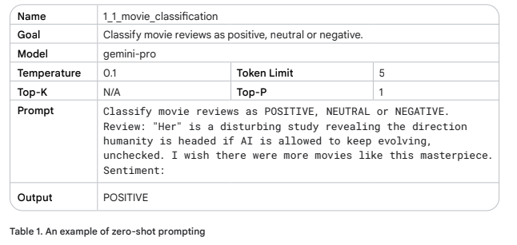
When zero-shot doesn’t work, you can provide demonstrations or examples in the prompt,
which leads to “one-shot” and “few-shot” prompting. General prompting / zero shot


### One-shot & few-shot
Ek one-shot prompt ek hi misaal deta hai, is liye is ka naam one-shot hai. Is ka maqsad yeh hai ke model ko ek misaal di jaye jis ki naqal kar ke woh task ko behtar tareeke se mukammal kar sake.

* Ek **few-shot** prompt model ko kai misaalein deta hai. Yeh tareeqa model ko ek pattern dikhata hai jis ki woh pairvi karta hai. Yeh idea one-shot jaisa hai, lekin chahiye wale pattern ki kai misaalein model ke pattern follow karne ke imkanat ko barhati hain.

* **Few-shot** prompting ke liye kitni misaalon ki zarurat hoti hai, yeh kuch cheezon par munhasir hai, jaise task ki complexity, misaalon ki quality, aur aap ke istemal karda generative AI (gen AI) model ki salahiyatein. Ek aam qayeda ke taur par, few-shot prompting ke liye kam az kam teen se paanch misaalein istemal karni chahiyein. Haan, zyada complex tasks ke liye aap ko shayad zyada misaalon ki zarurat ho, ya aap ke model ki input length limitation ki wajah se kam misaalein istemal karni par sakti hain.
<br><br>
Table 2 mein ek few-shot prompt ki misaal di gayi hai, chaliye hum pehle jaisi gemini-pro model configuration settings ka istemal karte hain, siwaye is ke ke token limit ko barhaya jaye taake zyada lambay jawab ki zarurat ko pura kiya ja sake.

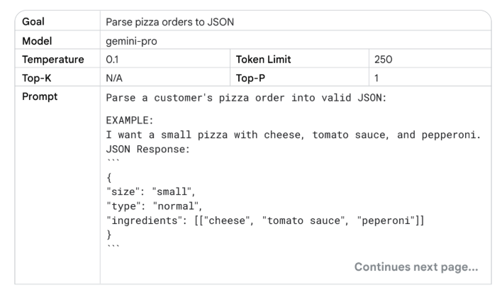
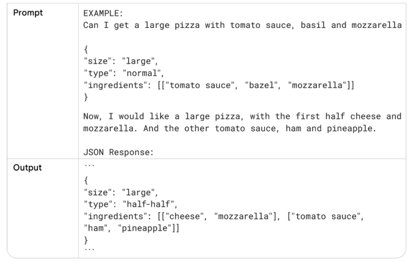
Jab aap apne prompt ke liye misalein chunte hain, to aisi misalein istemal karein jo us kaam se mutalliq hon jo aap anjam dena chahte hain. Misalein mukhtalif, aala miyaar ki, aur achi tarah likhi honi chahiye. Ek chhoti si galti bhi model ko uljha sakti hai aur is ke n natije mein matlooba output nahi milega.
<br><br>
Agar aap aisi output paida karne ki koshish kar rahe hain jo mukhtalif inputs ke liye mazboot ho, to apni misalon mein edge cases shamil karna zaroori hai. Edge cases aisi inputs hain jo ghair mamooli ya ghair mutawaqqe hain, lekin model ko phir bhi unhein sambhalne ke qabil hona chahiye.

### System, contextual and role prompting
System, contextual aur role prompting, yeh sab LLMs (Large Language Models) ko text banane mein rahnumai karne ke liye istemal hone wali takneek hain, lekin yeh mukhtalif pehluon par tawajjoh markooz karti hain:
* System prompting language model ke liye majmoi silsila-e-kalam aur maqsad ko tay karti hai. Yeh 'badi tasveer' ki wazahat karti hai ke model ko kya karna chahiye, jaise ke kisi zaban ka tarjuma karna, kisi jaize (review) ki darja bandi karna, waghera.
* Contextual prompting mojooda guftagu ya kaam se mutalliq makhsoos tafseelat ya pas manzar ki maloomat faraham karti hai. Yeh model ko is baat ki barikiyon ko samajhne mein madad deti hai ke kya poocha ja raha hai aur usi ke mutabiq jawab ko dhalne mein madad karti hai.
* Role prompting language model ko apnane ke liye ek makhsoos kirdar ya shanakht deti hai. Yeh model ko aise jawab banane mein madad deti hai jo diye gaye kirdar aur us se munsalik ilm aur rawaiye ke mutabiq hon.

<br><br>
System, contextual aur role prompting ke darmiyan kafi had tak overlap ho sakta hai. Maslan, ek prompt jo system ko ek kirdar saunpta hai, us mein ek sayaq o sabaq (context) bhi ho sakta hai.

**Tahum, har qism ke prompt ka bunyadi maqsad thora mukhtalif hota hai:**
* System prompt: Yeh model ki bunyadi salahiyaton aur sab se ahem maqsad ki wazahat karta hai.
* Contextual prompt: Yeh jawab ki rahnumai ke liye fori, kaam se mutalliq maloomat faraham karta hai. Yeh mojooda kaam ya input ke liye intehai makhsoos hota hai, jo ke dynamic (mutaharik) hai.
* Role prompt: Yeh model ke output ke andaz aur aawaz ko ek frame deta hai. Yeh specificity (khususiyat) aur personality (shakhsiyat) ki ek teh ka izafa karta hai.

<br>
System, contextual, aur role prompts ke darmiyan farq karna wazeh iraday ke sath prompts design karne ke liye ek dhancha faraham karta hai, jo lachakdar combinations ki ijazat deta hai aur is baat ka tajziya karna aasan banata hai ke har prompt ki qism language model ke output par kis tarah asar andaz hoti hai.
<br>
<br>
Aaiye in teen mukhtalif qism ke prompts par ghaur karte hain.


### System prompting
Table 3 mein ek system prompt hai, jahan main ne output wapas karne ke tariqe ke bare mein izafi maloomat faraham ki hain. Main ne takhliqi satah (creativity level) ko badhane ke liye temperature badha diya, aur ek onchi token limit muqarrar ki. Taham, meri is wazeh hidayat ki wajah se ke output kaise wapas karna hai, model ne izafi text nahi diya.

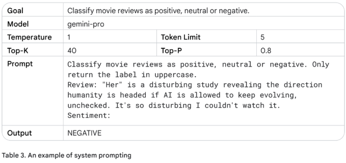

System prompts makhsoos zaruriyat ko poora karne wala output paida karne ke liye mufeed ho sakte hain. 'System prompt' ka naam darasal 'system ko ek izafi kaam dena' hai. Misal ke tor par, aap ek system prompt ka istemal karke ek aisa code snippet bana sakte hain jo ek makhsoos programming language ke sath compatible ho, ya aap ek makhsoos saakht (structure) wapas karne ke liye system prompt ka istemal kar sakte hain. Table 4 par ghaur karen, jahan main output ko JSON format mein wapas karta hoon.

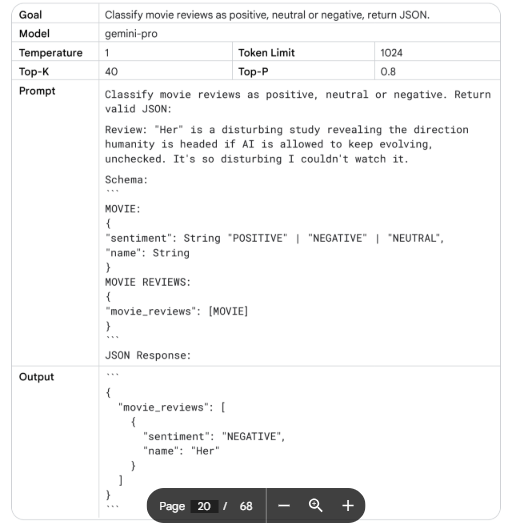
Data nikalne wale prompt se JSON objects wapas karne ke kuch fayde hain. Ek haqeeqi-duniya ki application mein mujhe is JSON format ko dastani tor par banane ki zaroorat nahi padti, main data ko pehle se hi tartib shuda shakal mein wapas kar sakta hoon (datetime objects ke sath kaam karte waqt bohat mufeed), lekin sab se ahem baat yeh hai ke JSON format ke liye prompt karne se model ko ek structure banane aur hallucinations ko mehdood karne par majboor kiya jata hai.
<br>
<br>
System prompts safety aur toxicity ke liye bhi bohat mufeed ho sakte hain. Output ko control karne ke liye, apne prompt mein sirf ek izafi line shamil kar dein jaise: 'Aap ko apne jawab mein ba-izzat rehna chahiye.'

### Role prompting
Role prompting prompt engineering mein ek takneek hai jis mein gen AI model ko ek makhsoos kirdar saunpa jata hai. Yeh model ko ziyada mutalliq aur maloomati output paida karne mein madad kar sakta hai, kyunkay model apne jawabat ko us makhsoos kirdar ke mutabiq dhal sakta hai jo usay diya gaya hai.
<br>
<br>
Misal ke tor par, aap ek gen AI model ko role prompt kar sakte hain ke woh ek kitab ka editor ho, ek kindergarten ka ustaad ho, ya ek tehreeki muqarrir (motivational speaker) ho. Jab model ko ek kirdar saunp diya jaye, to aap usay aise prompts de sakte hain jo us kirdar ke liye makhsoos hon. Maslan, aap ek ustad ko ek lesson plan banane ke liye prompt kar sakte hain jis ka woh baad mein jaiza le saken. Table 5 mein dekhen, jahan model ek travel guide ka kirdar ada karta hai.


Upar di gayi misal ek travel agent ka kirdar nibhane ki ek misal hai. Jab aap kirdar ko geography ke ustad mein badlenge, to aap dekhenge ke aapko ek mukhtalif jawab milega.
<br>
Ek AI model ke liye ek kirdar ka nazariya tay karna usay us lehje, andaz, aur markooz maharat ka ek blueprint deta hai jis ki aap talash mein hain, taake aap apne output ki quality, relevance, aur asardari ko behtar bana saken.

**Yahan kuch styles hain jin mein se aap chun sakte hain jo mujhe asardaar lagte hain:**
* Confrontational (Muqaablaati), Descriptive (Tafseeli), Direct (Seedha), Formal (Rasmi), Humorous (Mazahiya), Influential (Mutasir kun), Informal (Ghair rasmi), Inspirational (Ilhami), Persuasive (Qail karne wala)
Aaiye Table 6 mein apne prompt ko badalte hain taake us mein mazahiya aur ilhami andaz shamil ho.


### Contextual prompting
Contextual prompts faraham karke, aap yeh yakeeni banane mein madad kar sakte hain ke aapki AI interactions jitni mumkin ho saken, be-rok-tok aur kargar hon. Model aapki darkhwast ko ziyada tezi se samajh payega aur ziyada durust aur mutalliq jawab paida kar payega, jaisa ke aap Table 7 ki misal mein dekh sakte hain
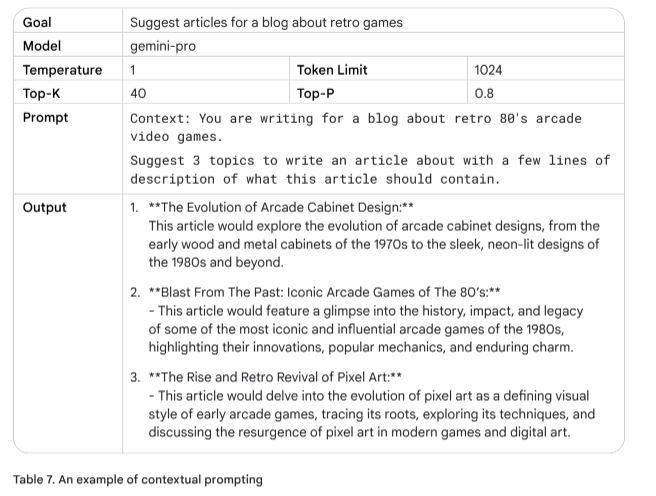

### Step-back prompting
Step-back prompting LLM (Large Language Model) ki karkardagi ko behtar banane ki ek takneek hai, jis mein LLM ko pehle maujooda makhsoos kaam se mutalliq ek aam sawal par ghaur karne ke liye prompt kiya jata hai, aur phir us aam sawal ke jawab ko makhsoos kaam ke liye baad mein aanay wale prompt mein shamil kiya jata hai. Yeh 'step back' LLM ko makhsoos masle ko hal karne ki koshish karne se pehle mutalliq pas manzar ki maloomat aur istidlal ke amal ko fa'al karne ki ijazat deta hai.
<br>
<br>
Wasi' tar aur bunyadi usoolon par ghaur karke, LLMs ziyada durust aur gehrayi se bhare jawabat paida kar sakte hain. Step-back prompting LLMs ko tanqeedi soch rakhne aur apne ilm ko naye aur takhliqi tareeqon se istemal karne ki targheeb deta hai. Yeh aakhri prompt ko badal deta hai jo kaam kar raha hota hai, LLM ke parameters mein ziyada ilm ka istemal karke, jo warna seedhe prompt karne par kaam nahi aata.
<br>
<br>
Yeh LLM ke jawabat mein ta'assubat (biases) ko kam karne mein madad kar sakta hai, aam usoolon par tawajjoh markooz karke bajaye makhsoos tafseelat ke, step-back prompting.
<br>
<br>
Aaiye in misalon ko dekhte hain taake yeh samajh saken ke step-back prompting nataij ko kaise behtar bana sakta hai. Aaiye pehle ek riwayati prompt (Table 8) ka jaiza len, is se pehle ke hum is ka muqabla step-back prompt (Table 9) se karen:

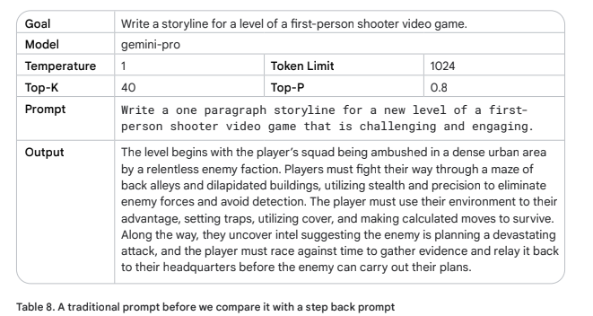
<br>
Jab aap temperature ko 1 par set karte hain, to aapko kisi kahani ke liye har qism ki takhliqi tehreeren mil sakti hain, lekin yeh kafi had tak be-tarteeb aur aam bhi hoti hain. To aaiye ek qadam peeche haten:
<br>

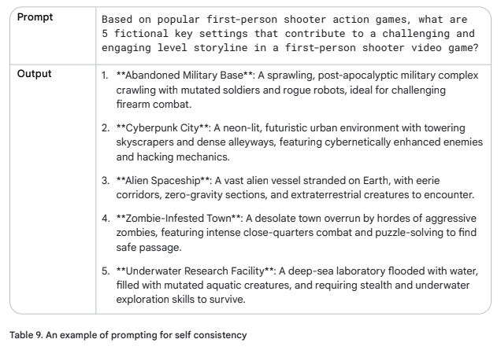
<br>

Haan, woh mauzu'at (topics) ek first-person video game ke liye behtar lagte hain. Aaiye asal prompt par wapas chalte hain, lekin is baar hum step-back ke jawab ko context ke tor par shamil karte hain aur dekhte hain ke yeh kya jawab deta hai.
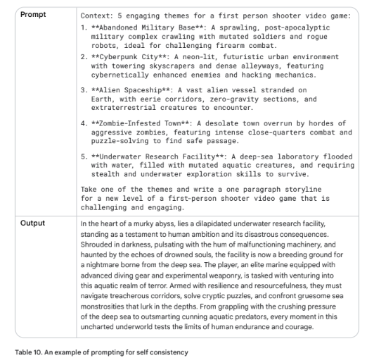
<br>
Yeh ek dilchasp video game lagta hai! Step-back prompting techniques ka istemal karke aap apne prompts ki durustgi (accuracy) mein izafa kar sakte hain.

### Chain of Thought (CoT)
Chain of Thought (CoT) prompting intermediate reasoning steps paida karke LLMs ki reasoning salahiyaton ko behtar banane ki ek takneek hai. Yeh LLM ko ziyada durust jawab paida karne mein madad karta hai. Aap isay few-shot prompting ke sath mila sakte hain taake ziyada pecheeda kaamo par behtar nataij hasil hon jin mein jawab dene se pehle reasoning ki zaroorat hoti hai, kyunkay yeh zero-shot chain of thought ke sath ek challenge hai.
<br><br>
CoT ke bohat se fayde hain. Sab se pehle, yeh kam koshish wala hone ke bawajood bohat kargar hai aur off-the-shelf LLMs ke sath achi tarah kaam karta hai (yani finetune karne ki zaroorat nahi). Aapko CoT prompting ke sath interpretability bhi milti hai, kyunkay aap LLM ke jawabat se seekh sakte hain aur reasoning steps dekh sakte hain jo apnaye gaye. Agar koi kharabi ho, to aap uski shanakht kar sakenge. Chain of thought mukhtalif LLM versions ke darmiyan harkat karte waqt robustness ko behtar banata hua nazar aata hai. Jis ka matlab hai ke aapke prompt ki karkardagi mukhtalif LLMs ke darmiyan kam tabdeel honi chahiye bajaye iske ke agar aapka prompt reasoning chains ka istemal nahi karta. Beshak kuch nuqsanat bhi hain, lekin woh kisi had tak badeeh (intuitive) hain.
<br><br>
LLM ke jawab mein chain of thought reasoning shamil hoti hai, jis ka matlab hai ziyada output tokens, jis ka matlab hai predictions par ziyada paise lagte hain aur ziyada waqt lagta hai.
<br><br>
Table 11 mein darj zail misal ki wazahat karne ke liye, aaiye pehle ek aisa prompt banane ki koshish karte hain jo CoT prompting ka istemal nahi kar raha ho taake bade language model ki kamzoriyan ko dikhaya ja sake.
<br>

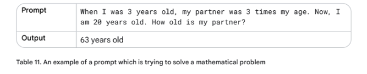
<br>
Oho. Woh zaahir hai ghalat jawab hai. Darasal, LLMs aksar riyaziyati kaamo mein mushkil mehsoos karte hain aur ghalat jawabat de sakte hain – yahan tak ke do adadon ko zarb dene jaise mamooli kaam ke liye bhi. Yeh is wajah se hai ke unhein badi miqdar mein text par train kiya jata hai aur riyazi mein ek mukhtalif tareeqe ki zaroorat ho sakti hai. To aaiye dekhte hain ke kya intermediate reasoning steps output ko behtar banayenge.
<br>

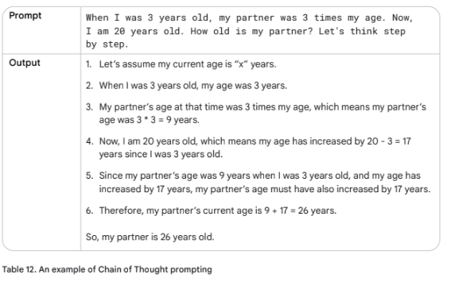
<br>
The final answer is correct. That’s because we clearly instructed the LLM to explain each step instead of just returning an answer. It’s interesting to see that the model adds up the 17 increased years. In my head I would take the difference of years between my partner and me and add those up. (20+(9-3)). Let’s help the model to think a little bit more like me.
Okay, ab aakhri jawab durust hai. Iski wajah yeh hai ke humne LLM ko sirf jawab dene ke bajaye har qadam ki wazahat karne ki wazeh hidayat di thi. Yeh dekhna dilchasp hai ke model ne 17 barhe hue saalon ko jama kiya. Mere zehan mein, main apne partner aur apne darmiyan saalon ka farq leta aur unhein jama karta (20+(9-3)). Aaiye model ko thoda aur meri tarah sochne mein madad karte hain.

<br>
Table 12 'zero-shot' Chain of thought ki ek misal hai. Chain of thought prompting bahut taqatwar ho sakti hai jab isay single-shot ya few-shot ke sath jora jaye, jaisa ke aap Table 13 mein dekh sakte hain:
<br>

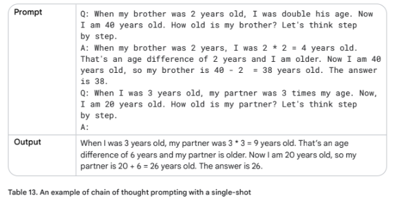

<br>

Chain of thought mukhtalif use-cases ke liye mufeed ho sakti hai. Code generation ke bare mein sochen, request ko chand steps mein taqseem karne ke liye, aur unhein code ki makhsoos lines se map karne ke liye. Ya synthetic data banane ke liye jab aapke paas kisi qism ka seed ho jaisa ke "Product ka naam XYZ hai, ek description likhen jo model ko un assumptions ke zariye rahnumai kare jo aap product ke diye gaye unwan ki buniyad par karenge." Aam tor par, koi bhi kaam jo 'baat cheet ke zariye' hal kiya ja sakta hai, chain of thought ke liye ek acha candidate hai. Agar aap masle ko hal karne ke steps samjha sakte hain, to chain of thought azmayen.
<br><br>
Barahe meherbani GoogleCloudPlatform Github repository mein host kiye gaye notebook10 ka hawala den jo CoT prompting par mazeed tafseelat faraham karega: Is chapter ke best practices section mein, hum Chain of thought prompting se mutalliq kuch behtareen tareeqe seekhenge.

### Self-consistency (Khud-mutabiqat)
Jabkay bade language models ne mukhtalif NLP kaamo mein numaya kamyabi dikhayi hai, unki reasoning ki salahiyat ko aksar ek hadd ke taur par dekha jata hai jise sirf model ke size mein izafe se qaboo nahi kiya ja sakta. Jaisa ke humne pichle Chain of Thought prompting section mein seekha, model ko reasoning steps paida karne ke liye prompt kiya ja sakta hai jaisa ke ek insaan kisi masle ko hal karta hai. Tahum, CoT ek saada 'greedy decoding' strategy ka istemal karta hai, jo iski kargardagi ko mehdood karta hai. Self-consistency sampling aur majority voting ko mila kar mukhtalif reasoning paths paida karta hai aur sab se ziyada mutabiq jawab ka intikhab karta hai. Yeh LLMs ke zariye paida kiye gaye jawabat ki durustgi aur rabt ko behtar banata hai.
<br><br> 
Self-consistency kisi jawab ke durust hone ki pseudo-probability likelihood deta hai, lekin zahir hai ke iske akhrajat bohat ziyada hote hain.

**Yeh darj zail aqsam par amal karta hai:**
1. Mukhtalif reasoning paths paida karna: LLM ko ek hi prompt kayi baar faraham kiya jata hai. High temperature setting model ko masle par mukhtalif reasoning paths aur nazariyat paida karne ki targheeb deti hai.
2. Har paida shuda jawab se jawab nikalna.
3. Sab se aam jawab ka intikhab karna.
<br><br> 
Aaiye ek email classification system ki misal dekhte hain, jo ek email ko IMPORTANT ya NOT IMPORTANT ke taur par classify karta hai. Ek zero-shot chain of thought prompt LLM ko kayi baar bheja jayega, yeh dekhne ke liye ke har submit ke baad jawabat mukhtalif hote hain ya nahi. Email mein istemal kiye gaye dostana lehje, alfaaz ke intikhab aur tanz o maza par ghaur karen. Yeh sab LLM ko dhoka de sakta hai.
<br> 


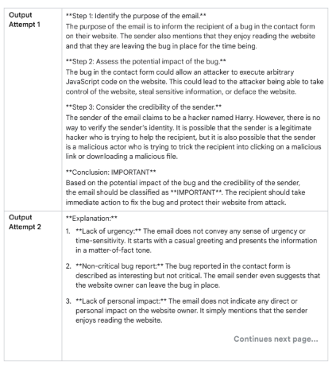

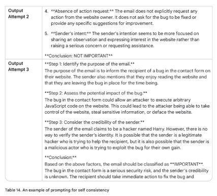
<br> 

Aap upar diye gaye prompt ka istemal karke yeh dekh sakte hain ke kya yeh mutabiq classification wapas karta hai. Aap jis model ka istemal kar rahe hain aur temperature configuration par munhasir karte hue, yeh "IMPORTANT" ya "NOT IMPORTANT" wapas kar sakta hai.<br><br> 
Bohat se Chains of Thoughts paida karke, aur sab se aam jawab ("IMPORTANT") ko ikhtiyar karke, hum LLM se ziyada mustaqil tor par durust jawab hasil kar sakte hain.<br><br> 
Yeh misal batati hai ke self-consistency prompting ka istemal LLM ke jawab ki durustgi ko behtar banane ke liye kaise kiya ja sakta hai, mukhtalif nazariyat par ghaur karte hue aur sab se ziyada mutabiq jawab ka intikhab karte hue.


### Tree of Thoughts (ToT)
Ab jab hum chain of thought aur self-consistency prompting se waqif ho chuke hain, to aaiye Tree of Thoughts (ToT) ka jaiza len. Yeh CoT prompting ke tasawwur ko aam karta hai kyunkay yeh LLMs ko ek waqt mein kayi mukhtalif reasoning paths ko explore karne ki ijazat deta hai, bajaye sirf ek seedhi line mein chain of thought ki pairwi karne ke. Iski tasveer Figure 1 mein di gayi hai.
<br> 

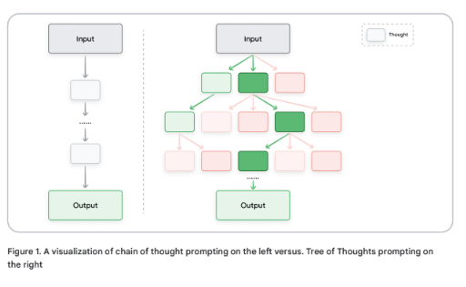
<br> 
Yeh tareeqa ToT ko khusoosi tor par un pecheeda kaamo ke liye behtar banata hai jin mein exploration ki zaroorat hoti hai. Yeh afkaar ke darakht (tree of thoughts) ko barqarar rakh kar kaam karta hai, jahan har fikr (thought) ek mutabbiq zaban ki tarteeb (coherent language sequence) ki numaindagi karti hai jo ek masle ko hal karne ki taraf ek darmiyani qadam ke taur par kaam karti hai. Phir model darakht mein mukhtalif nodes se branch out karke mukhtalif reasoning paths ko explore kar sakta hai.

<br><br> 
Ek shandar notebook hai, jo 'Large Language Model Guided Tree-of-Thought' paper par mabni Tree of Thought (ToT) ko thoda mazeed tafseel se dikhati hai.


### ReAct (reason & act)
Reason and act (ReAct) prompting ek aisa paradigm hai jo LLMs ko qudrati zaban ki reasoning ko external tools (search, code interpreter, waghera) ke sath mila kar pecheeda kaamo ko hal karne ke qabil banata hai, jis se LLM kuch specific actions anjam de sakta hai, jaise ke external APIs ke sath rabta karke maloomat nikalna, jo agent modeling ki taraf pehla qadam hai.
<br><br> 
ReAct is tarah kaam karta hai jaisay insaan haqeeqi duniya mein karte hain, kyunkay hum zubani tor par reasoning karte hain aur maloomat hasil karne ke liye actions le sakte hain. ReAct mukhtalif domains mein deegar prompt engineering approaches ke muqable mein behtar karkardagi dikhata hai.
<br><br> 
ReAct prompting reasoning aur acting ko ek thought-action loop mein mila kar kaam karta hai. LLM pehle masle par reasoning karta hai aur amal ka ek mansooba (plan of action) tayyar karta hai. Phir woh mansoobe mein mojood actions anjam deta hai aur nataij ka mushahida karta hai. Iske baad LLM mushahidat ko apni reasoning ko update karne aur amal ka ek naya mansooba tayyar karne ke liye istemal karta hai. Yeh amal us waqt tak jari rehta hai jab tak LLM masle ka hal nahi nikal leta.
<br><br> 
Ise amal mein dekhne ke liye, aapko kuch code likhna hoga. Code Snippet 1 mein main Python ke liye langchain framework ka istemal kar raha hoon, VertexAI (google-cloud-aiplatform) aur google-search-results pip packages ke sath.

<br><br> 

Is sample ko chalane ke liye aapko https://serpapi.com/manage-api-key se ek (muft) SerpAPI key banani hogi aur ek environment variable SERPAPI_API_KEY set karna hoga.
<br><br> 
Agla qadam, chaliye kuch Python code likhte hain, jis mein LLM ke liye yeh kaam hoga ke woh maloom kare: Kitne bachon ke mashoor baap hain jo Metallica band mein performance dete hain.

```bash
from langchain.agents import load_tools
from langchain.agents import initialize_agent
from langchain.agents import AgentType
from langchain.llms import VertexAI
prompt = "How many kids do the band members of Metallica have?"
llm = VertexAI(temperature=0.1)
tools = load_tools(["serpapi"], llm=llm)
agent = initialize_agent(tools, llm,
agent=AgentType.ZERO_SHOT_REACT_DESCRIPTION, verbose=True)
agent.run(prompt)
```
Code Snippet 2 nataij dikhata hai. Ghaur karen ke ReAct paanch searches ki ek chain banata hai. Darasal, LLM band ke naam maloom karne ke liye Google search ke nataij ko scrape kar raha hai. Phir, yeh nataij ko observations ke tor par list karta hai aur agli search ke liye thought ko chain karta hai.
<br>

```bash
> Entering new AgentExecutor chain...
Metallica has 4 members.
Action: Search
Action Input: How many kids does James Hetfield have?
Observation: three children
Thought: 1/4 Metallica band members have 3 children
Action: Search
Action Input: How many kids does Lars Ulrich have?
Observation: 3
Thought: 2/4 Metallica band members have 6 children
Action: Search
Action Input: How many kids does Kirk Hammett have?
Observation: Hammett has been married to his second wife Lani since 1998.
They have two sons, Angel (b. September 29, 2006) and Vincenzo (b. June
28, 2008).
Thought: 3/4 Metallica band members have 8 children
Action: Search
Action Input: How many kids does Robert Trujillo have?
Observation: 2
Thought: 4/4 Metallica band members have 10 children
Final Answer: 10
```
<br>

Code Snippet 2 yeh maloom karta hai ke Metallica band ke chaar band members hain. Phir yeh har band member ko talaash karta hai taake bachon ki kul tadaad talab kare aur unhein jama kare. Aakhir mein, yeh bachon ki kul tadaad ko aakhri jawab ke tor par wapas karta hai.
<br><br> 
Amali tor par ReAct prompting ke liye yeh samajhna zaroori hai ke aapko pichle prompts/responses ko musalsal dobara bhejna hoga (aur izafi paida shuda content ki trimming karni hogi) aur sath hi model ko munasib misalon/hidayat ke sath tayyar karna hoga. Barahe meherbani GoogleCloudPlatform Github repository mein host kiye gaye notebook14 ka hawala den, jo ek ziyada mufassal misal ke sath asal LLM inputs aur outputs ko thodi mazeed tafseel se dikhata hai.


### Automatic Prompt Engineering (APE)
Is marhale par aapko ehsas ho sakta hai ke prompt likhna pecheeda ho sakta hai. Kya yeh acha nahi hoga ke isay automate kiya jaye (prompts likhne ke liye prompt likhna)? Khair, ek tareeqa hai: Automatic Prompt Engineering (APE). Yeh tareeqa na sirf insani input ki zaroorat ko kam karta hai balkay mukhtalif kaamo mein model ki karkardagi ko bhi behtar banata hai.
<br><br> 
Aap ek model ko mazeed prompts banane ke liye prompt karenge. Unki jaanch karenge, mumkin hai achche prompts ko tabdeel karein. Aur yeh amal dohra'en.
<br><br> 
Maslan, aap automatic prompt engineering ka istemal kar sakte hain jo ek merchandise t-shirt webshop ke liye chatbot ko train karne mein madad karega. Hum yeh maloom karna chahte hain ke customer band merchandise t-shirt kharidne ke liye apne order ko kis tarah mukhtalif tareeqon se bayan kar sakte hain.
<br><br> 

1. Woh prompt likhen jo output variants paida karega. Is misal mein, main 10 hidayat paida karne ke liye gemini-pro ka istemal kar raha hoon. Table 15 dekhen.
<br>

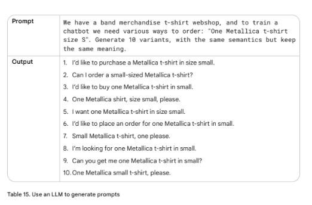
<br> 

2. Tamam instruction candidates ka jaiza len, chunay gaye metric ki buniyad par candidates ko score karte hue. Maslan, aap BLEU (Bilingual Evaluation Understudy) ya ROUGE (Recall-Oriented Understudy for Gisting Evaluation) ka istemal kar sakte hain.
3. Sab se ziyada evaluation score wale instruction candidate ka intikhab karen. Yeh candidate woh aakhri prompt hoga jise aap apni software application ya chatbot mein istemal kar sakte hain. Aap select kiye gaye prompt ko tabdeel bhi kar sakte hain aur dobara jaanch kar sakte hain.


### Code prompting
Gemini bunyadi tor par text-based prompts par tawajjoh markooz karta hai, jis mein code wapas karne ke liye prompts likhna bhi shamil hai. Aaiye Vertex AI Studio chalte hain aur kuch coding examples dekhne ke liye in prompts ko test karte hain.

### Code likhne ke liye prompts
Gemini ek developer bhi ho sakta hai aur aapko kisi bhi pasandeeda programming language mein code likhne mein madad kar sakta hai. Ek developer ke tor par yeh aapko code likhne ke amal ko tez karne mein madad kar sakta hai.
<br><br> 
Tasawwur karein aapki machine par sainkdon files wala ek folder hai jinhein rename karne ki zaroorat hai. Har file ko rename karne mein aapko kafi waqt lagega. Aap thodi Bash jaante hain, aur is kaam ko automate karne ke liye ek script likh sakte hain, lekin is mein bhi kuch waqt lag sakta hai. To chaliye ek prompt likhte hain. Aap prompt ko public consumer chatbot Gemini mein likh sakte hain, ya agar aap raazdari ke bare mein ziyada fikarmand hain, to aap in prompts ko apne Google Cloud account mein Vertex AI Studio mein likh sakte hain. Vertex AI Studio ka fayda yeh hai ke aap temperature waghera configure kar sakte hain.

<br>

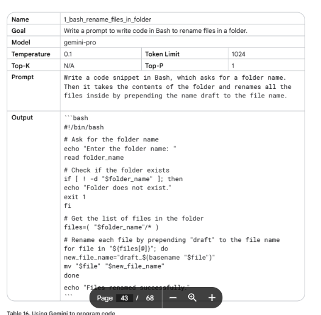

<br>
Yeh mujhe acha code lagta hai – yeh document bhi kiya gaya hai! Tahum, kyunkay LLMs reasoning nahi kar sakte aur training data ko dohrayate hain, isliye yeh zaroori hai ke aap apne code ko pehle padhen aur test karen.
<br><br>
Woh lamha jis ka hum sab intezar kar rahe hain, kya yeh waqai kaam karta hai?


Aaiye pehle ise ek test folder ke sath azmate hain jis mein sirf chand files hon, jinhein filename.txt se draft_filename.txt mein rename karne ki zaroorat hogi.
<br><br>

* Table 16 se output ko copy karen (bash text wrapper ke baghair), aur isay ek nayi file mein paste karen jis ka naam ho: "rename_files.sh".
* Ek terminal window kholen aur type karen: . rename_files.sh. Yeh ek folder ka naam darj karne ke liye kahega, maslan test. aur enter dabayen.
* Script theek chal rahi hai. Aapko message dikhega: Files renamed successfully.
Jab aap test folder mein dekhenge, to ghaur karen ke tamam files ko bilkul theek draft_filename.txt mein rename kar diya gaya hai.
<br>
Yeh kaam kar gaya!
<br><br>
Ek developer ke tor par jab aap teams mein kaam karte hain to aapko kisi aur ka code padhna hota hai. Gemini is mein bhi aapki madad kar sakta hai. Aaiye Table 16 se code output lete hain, comments hata dete hain aur bade language model se poochte hain ke kya ho raha hai, Table 17 dekhen:
<br>

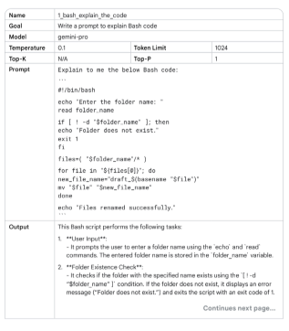
<br>

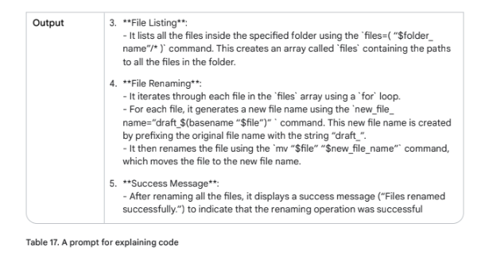

<br>

### Prompts for translating code
Table 16 ka bash code theek kaam karta hai. Tahum, yeh script us waqt sahih mayno mein qabil-e-istemal ho sakti hai jab yeh mujhse file names ke liye prompt kare, ideal tor par isay UI ke sath ek alag application ke tor par kaam karna chahiye. Ek ibtedai nuqte ke tor par, Python Bash ke muqablay mein ek (web) application ke liye behtar zaban hogi. LLMs code ko ek zaban se doosri zaban mein tarjuma karne mein madad kar sakte hain. Table 18 mein misal dekhen:
<br>

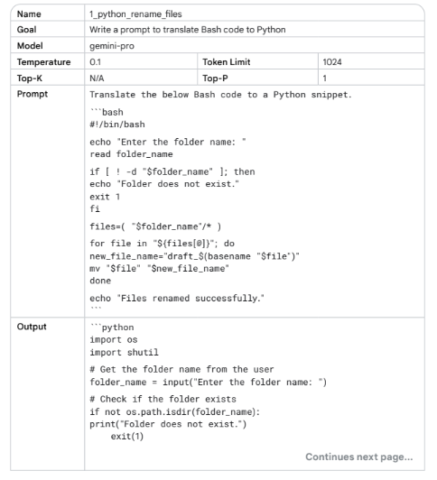
<br>

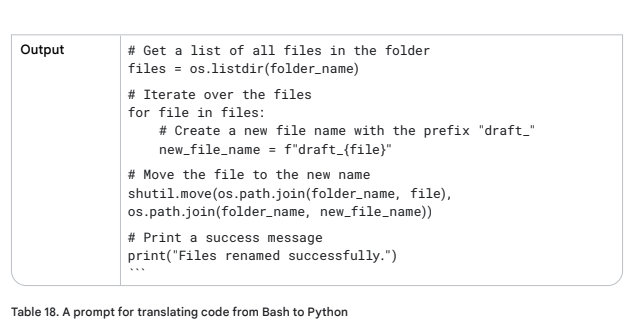

<br>

Code ko padhen aur review karen. Prompt se output copy karen aur use ek nayi file mein paste karen: file_renamer.py. Code ko test karne ke liye ek Terminal window kholen, aur darj zail command chalayen: python file_renamer.py.
<br><br>
NOTE: Jab Vertex AI mein Language Studio mein (Python) code ke liye prompt kar rahe hon, to aapko 'Markdown' button par click karna hoga. Warna aapko saada text milega jis mein lines ki durust indenting gayab hogi, jo Python code chalane ke liye zaroori hai.

### Prompts for debugging and reviewing code
Aaiye Table 18 ke code mein dastani tor par kuch tarameem (edits) karte hain. Yeh user se filename prefix ke liye prompt karega, aur is prefix ko bade huruf (upper case characters) mein likhega. Snippet *3 mein misali code dekhen, lekin yeh kya museebat hai. Ab yeh Python errors deta hai!

```bash
import os
import shutil
folder_name = input("Enter the folder name: ")
prefix = input("Enter the string to prepend to the filename: ")
text = toUpperCase(prefix)
if not os.path.isdir(folder_name):
print("Folder does not exist.")
exit(1)
files = os.listdir(folder_name)
for file in files:
new_filename = f"{text}_{file}"
shutil.move(os.path.join(folder_name, file),
os.path.joi(folder_name, new_file_name))
print("Files renamed successfully.")
```
* Doh! That looks like a bug:
<br>

```bash
The below Python code gives an error:
Traceback (most recent call last):
File “/Users/leeboonstra/Documents/test_folder/rename_files.py”, line 7,
in <module>
text = toUpperCase(prefix)
NameError: name ‘toUpperCase’ is not defined
```
<br>
Let’s see if we can ask the large language model to debug and review code. Have a look into
Table 19:
<br>

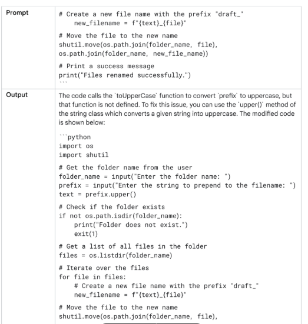
<br>

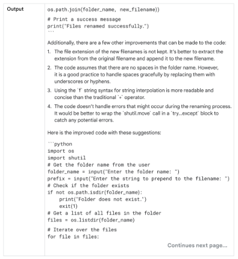

<br>

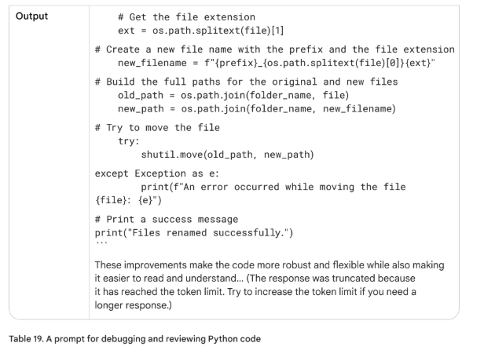
<br>


### What about multimodal prompting?
Code ke liye prompting ab bhi wahi aam large language model istemal karta hai. Multimodal prompting ek alag masla hai, yeh ek aisi takneek ki taraf ishara karta hai jahan aap ek large language model ko rahnumai karne ke liye mutaddid input formats istemal karte hain, bajaye sirf text par inhesar karne ke. Is mein text, images, audio, code, ya yahan tak ke deegar formats ka combination shamil ho sakta hai, jo model ki salahiyaton aur maujooda kaam par munhasir hai.

### Best Practices

Sahi prompt dhoondne ke liye tinkering (mukhtalif tarteeben azmana) zaroori hai. Vertex AI mein Language Studio aapke prompts ke sath khelne ke liye ek behtareen jagah hai, jahan mukhtalif models ke khilaf test karne ki salahiyat maujood hai.
<br>
Prompt engineering mein mahir banne ke liye darj zail behtareen tareeqon ka istemal karen.


### Provide examples
Sab se ahem behtareen tareeqa yeh hai ke prompt ke andar (one shot / few shot) misalen faraham ki jayen. Yeh bohat ziyada kargar hai kyunkay yeh ek taqatwar ta'aleemi tool ke taur par kaam karta hai. Yeh misalen matlooba outputs ya isi tarah ke jawabat ko numaya karti hain, jis se model un se seekh sakta hai aur us ke mutabiq apni generation ko dhal sakta hai. Yeh is tarah hai jaise model ko ek reference point ya target dena jise woh hasil karna chahta hai, apne jawab ki durustgi, style, aur lehje ko behtar banata hai taake woh aapki tawaqqoaat se behtar mel kha sake.

### Design with simplicity
Prompts mukhtasar, wazeh, aur aapke aur model dono ke liye samajhne mein aasan hone chahiye. Ek aam usool ke mutabiq, agar yeh aapke liye hi pecheeda hai to mumkin hai yeh model ke liye bhi pecheeda hoga. Koshish karen ke pecheeda zaban istemal na karen aur ghair zaroori maloomat faraham na karen.

```bash
Examples:
BEFORE:
I am visiting New York right now, and I'd like to hear more about great
locations. I am with two 3 year old kids. Where should we go during
our vacation?
AFTER REWRITE:
Act as a travel guide for tourists. Describe great places to visit in
New York Manhattan with a 3 year old.
Try using verbs that describe the action. Here’s a set of examples:
```
**Act, Analyze, Categorize, Classify, Contrast, Compare, Create, Describe, Define,
Evaluate, Extract, Find, Generate, Identify, List, Measure, Organize, Parse, Pick,
Predict, Provide, Rank, Recommend, Return, Retrieve, Rewrite, Select, Show, Sort,
Summarize, Translate, Write.**

### Be specific about the output
Matlooba output ke baare mein wazeh rahen. Ek mukhtasar hidayat LLM ki itni rahnumai nahi kar sakti ya bahut aam ho sakti hai. Prompt mein makhsoos tafseelat faraham karna (system ya context prompting ke zariye) model ko mutalliq cheezon par tawajjoh markooz karne mein madad kar sakta hai, jis se majmoi durustgi behtar hoti hai.
```bash
Examples:
DO:
Generate a 3 paragraph blog post about the top 5 video game consoles.
The blog post should be informative and engaging, and it should be
written in a conversational style.
DO NOT:
Generate a blog post about video game consoles.
```

### Use Instructions over Constraints
Instructions aur constraints prompting mein LLM ke output ki rahnumai ke liye istemal hote hain.
* Instruction jawab ke matlooba format, style, ya content par wazeh hidayat faraham karti hai. Yeh model ko is baat par rahnumai karti hai ke model ko kya karna chahiye ya kya paida karna chahiye.
* Constraint jawab par hudood (limitations) ya bandishon (boundaries) ka ek set hai. Yeh is baat ko mehdood karta hai ke model ko kya nahi karna chahiye ya kis cheez se bachna chahiye.
<br>

Badhti hui tehqeeq se pata chalta hai ke prompting mein misbat hidayat par tawajjoh markooz karna, constraints par bahut ziyada inhesar karne se ziyada kargar ho sakta hai. Yeh tareeqa is baat se mutabiqat rakhta hai ke insaan kya nahi karna chahiye ki lists ke bajaye misbat hidayat ko tarjeeh dete hain.<br><br>
Instructions seedhe matlooba nataij ko bayan karti hain, jabkay constraints model ko yeh sochne par majboor kar sakte hain ke kya ijazat hai. Yeh flexibility deta hai aur tay shuda hudood ke andar creativity ko farogh deta hai, jabkay constraints model ki salahiyat ko mehdood kar sakte hain. Iske alawa, constraints ki ek list ek doosre se takra sakti hai.<br><br>
Constraints ab bhi qeemati hain lekin khaas halaat mein. Model ko nuqsan deh ya muta'assib content paida karne se rokne ke liye ya jab ek sakht output format ya style ki zaroorat ho.<br><br>
Agar mumkin ho, to misbat hidayat ka istemal karen: model ko yeh batane ke bajaye ke kya nahi karna chahiye, use yeh batayen ke kya karna chahiye. Yeh uljhan se bachne aur output ki durustgi ko behtar banane mein madad kar sakta hai.
```bash
DO:
Generate a 1 paragraph blog post about the top 5 video game consoles.
Only discuss the console, the company who made it, the year, and total
sales.
DO NOT:
Generate a 1 paragraph blog post about the top 5 video game consoles.
Do not list video game names.
```
Ek behtareen tareeqe ke taur par, ibtida mein instructions ko tarjeeh den, wazeh tor par bayan karen ke aap model se kya karwana chahte hain aur sirf zaroorat padne par safety, wazahat ya makhsoos zaruriyat ke liye constraints ka istemal karen. Mukhtalif instructions aur constraints ke combinations ko test karne ke liye experiment karen aur iterate karen taake aap apne makhsoos kaamo ke liye behtareen tareeqa dhoond saken, aur inhein document karen.

### Control the max token length
LLM ke paida shuda jawab ki lambai ko control karne ke liye, aap ya to configuration mein ek max token limit set kar sakte hain, ya apne prompt mein wazeh tor par ek makhsoos lambai ki darkhwast kar sakte hain. Maslan:

**"Explain quantum physics in a tweet length message."**
### Use variables in prompts
Prompts ko dobara istemal karne aur unhein mazeed dynamic banane ke liye prompt mein variables ka istemal karen, jinhein mukhtalif inputs ke liye tabdeel kiya ja sakta hai. Maslan, jaisa ke Table 20 mein dikhaya gaya hai, ek prompt jo kisi shehar ke bare mein waqiyat batata hai. Prompt mein shehar ka naam hardcode karne ke bajaye, ek variable ka istemal karen. Variables aapka waqt aur mehnat bacha sakte hain, kyunkay aapko khud ko dohranay se bachne ki ijazat milti hai. Agar aapko kayi prompts mein ek hi maloomat ka tukda istemal karna hai, to aap use ek variable mein store kar sakte hain aur phir us variable ko har prompt mein reference kar sakte hain. Yeh us waqt bahut ma'qool lagta hai jab prompts ko apni applications mein integrate kiya jata hai.

<br>


<br>

### Experiment with input formats and writing styles
Mukhtalif models, model configurations, prompt formats, alfaaz ka intikhab, aur submits mukhtalif nataij de sakte hain. Lehaza, prompt attributes jaise ke style, alfaaz ka intikhab, aur prompt ki qism (zero shot, few shot, system prompt) ke sath experiment karna zaroori hai.
<br>
Misal ke tor par, revolutionary video game console Sega Dreamcast ke bare mein text paida karne ke maqsad wala prompt, ek sawal, ek bayan ya ek hidayat ke tor par banaya ja sakta hai, jis ke natije mein mukhtalif outputs milenge:
<br>
* Sawal: Sega Dreamcast kya thi aur yeh itni revolutionary console kyun thi?
* Bayan: Sega Dreamcast ek chhati nasl ki video game console thi jise Sega ne 1999 mein jari kiya tha. Yeh...
* Hidayat: Ek single paragraph likhen jo Sega Dreamcast console ko bayan kare aur bataye ke yeh itni revolutionary kyun thi.


### For few-shot prompting with classification tasks, mix up the classes
Aam tor par, aapke few-shot examples ki tarteeb (order) zyada mayne nahi rakhti. Tahum, classification tasks karte waqt, is baat ko yakeeni banayen ke aap few-shot examples mein mumkinah response classes ko aapas mein milayen. Yeh is wajah se hai ke aap warna examples ki makhsoos tarteeb ke liye overfitting kar sakte hain. Mumkinah response classes ko mila kar, aap is baat ko yakeeni bana sakte hain ke model har class ki bunyadi khasusiyat ko pehchan'na seekh raha hai, bajaye sirf examples ki tarteeb ko yaad karne ke. Is se na-dekhay gaye data par zyada mazboot aur aam karkardagi milegi. 
<br>
Ek acha usool yeh hai ke 6 few-shot examples se shuruat karen aur wahan se durustgi ko test karna shuru karen.

### Adapt to model updates
Aap ke liye yeh zaroori hai ke model architecture ki tabdeeliyon, shamil kiye gaye data, aur salahiyaton se ba-khabar rahen. Naye model versions ko azmayen aur apne prompts ko naye model features se behtar faida uthane ke liye adjust karen. Vertex AI Studio jaise tools aapke prompts ke mukhtalif versions ko store karne, test karne aur document karne ke liye behtareen hain.


### Experiment with output formats
Prompt input format ke alawa, output format ke sath bhi experiment karne par ghaur karen. Non-creative tasks jaise ke data nikalna, chunna, parse karna, tarteeb dena, ranking karna, ya darja bandi karna, ke liye apne output ko JSON ya XML jaise structured format mein wapas karne ki koshish karen.
Data nikalne wale prompt se JSON objects wapas karne ke kuch fayde hain. Ek haqeeqi-duniya ki application mein mujhe is JSON format ko dastani tor par banane ki zaroorat nahi padti, main data ko pehle se hi tartib shuda shakal mein wapas kar sakta hoon (datetime objects ke sath kaam karte waqt bohat mufeed), lekin sab se ahem baat yeh hai ke JSON format ke liye prompt karne se model ko ek structure banane aur hallucinations ko mehdood karne par majboor kiya jata hai.
<br>

**Mukhtasar yeh ke, apne output ke liye JSON istemal karne ke fayde:**
* Hamesha ek hi style mein wapas karta hai
* Us data par tawajjoh markooz karen jo aap hasil karna chahte hain
* Hallucinations ka imkan kam
* Ise rishta-dar (relationship aware) banayen
* Aapko data types milte hain
* Aap isay sort kar sakte hain
<br>
Few-shot prompting section mein Table 4 is baat ki misal dikhata hai ke structured output kaise wapas kiya jaye.


### JSON Repair
Jabkay JSON format mein data wapas karne ke beshumar fayde hain, yeh apne nuqsanat se khaali nahi hai. JSON ki structured nature, jabkay applications mein parsing aur istemal ke liye faida mand hai, plain text ke muqablay mein numaya tor par ziyada tokens ki zaroorat hoti hai, jis ke natije mein processing time badh jata hai aur akhrajat ziyada hote hain. Mazeed bar'aan, JSON ki verbosity (lafzon ki kasrat) output window ko aasani se pura bhar sakti hai, khaas tor par us waqt masla ban jaati hai jab generation token limits ki wajah se achaanak kat jaye. Yeh truncation (kata hua hissa) aksar ghalat JSON ka ba'is banta hai, jis mein ahem closing braces ya brackets gayab hote hain, jis se output qabil-e-istemal nahi rehta. Khush qismati se, json-repair library (jo PyPI par dastiyab hai) jaise tools in halaat mein anmol sabit ho sakte hain. Yeh library zehnana tareeqe se na-mukammal ya kharab JSON objects ko khud-ba-khud theek karne ki koshish karti hai, jis se yeh LLM-generated JSON ke sath kaam karte waqt, khaas tor par truncation ke imkani masalon se nipatne mein, ek ahem madadgar ban jaati hai.

