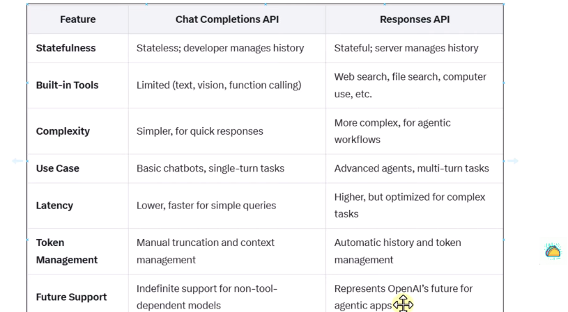

## OpenAI Agents SDK
The OpenAI Agents SDK enables you to build agentic AI apps in a lightweight, easy-to-use package with very few abstractions. It's a production-ready upgrade of our previous experimentation for agents, Swarm. The Agents SDK has a very small set of primitives:


1. Agents, which are LLMs equipped with instructions and tools
2. Handoffs, which allow agents to delegate to other agents for specific tasks
3. Guardrails, which enable the inputs to agents to be validated
4. Sessions, which automatically maintains conversation history across agent runs

In combination with Python, these primitives are powerful enough to express complex relationships between tools and agents, and allow you to build real-world applications without a steep learning curve. In addition, the SDK comes with built-in tracing that lets you visualize and debug your agentic flows, as well as evaluate them and even fine-tune models for your application

### Why use the Agents SDK

* Enough features to be worth using, but few enough primitives to make it quick to learn.
* Works great out of the box, but you can customize exactly what happens.

1. Agent loop: Built-in agent loop that handles calling tools, sending results to the LLM, and looping until the LLM is done.
2. Python-first: Use built-in language features to orchestrate and chain agents, rather than needing to learn new abstractions.
3. Handoffs: A powerful feature to coordinate and delegate between multiple agents.
4. Guardrails: Run input validations and checks in parallel to your agents, breaking early if the checks fail.
5. Sessions: Automatic conversation history management across agent runs, eliminating manual state handling.
6. Function tools: Turn any Python function into a tool, with automatic schema generation and Pydantic-powered validation
7. Tracing: Built-in tracing that lets you visualize, debug and monitor your workflows, as well as use the OpenAI suite of evaluation, fine-tuning and distillation tools.


### Openai ke api ki 2 types introduce krwai ha.
* Assistant Api (Assistant api me ye faida ha jo ap chat krty ha oska eik thrade banta us thrade me asi conversation store hoti ha server pr. )
* ChatCompletionApi (jo single input leta ha process krta ha. or output de deta ha. kuch yaad nh rakhta.) 
* Responsive Api (Assistant Api ka advance variant responsive api ha.)

# OpenAI Agents SDK: Provides a Foundational Layer For Building AI Agents

The OpenAI Agents SDK is an open‐source, lightweight framework that lets developers build and orchestrate “agentic” AI applications—systems where multiple AI “agents” work together to perform complex, multi-step tasks autonomously. 


## Questions to Start Thinking

OpenAI Agents SDK is designed very well, I have some questions so that you start thinking about the code:

1. The Agent class has been defined as a dataclass why?

#### Answer:

##### Agent class ko dataclass kyon banaya gaya hai?
Python me @dataclass decorator use karte hain jab tumhe ek class mainly data hold karne ke liye chahiye hoti hai, na ke complex logic likhne ke liye.

* Agent class bhi asal me ek container hai jo apne andar:
* instructions (system prompt / callable)
* tools
* output_type
* name
aur aur bhi config cheezen
rakhta hai.

#### Dataclass use karne ke fayde:

1. Less boilerplate code
Tumhe __init__, __repr__, __eq__ jaise boring methods manually likhne ki zarurat nahi hoti.

2. Readable aur simple
ek line me tum dekh sakte ho agent ke kya-kya fields (properties) hain.

3. Default values support
Tum easily default values aur optional cheezen define kar sakte ho.

4. Type hints ke sath clarity
har field ka type clear hota hai (e.g. instructions: str | Callable, tools: list[...]).

**agar Agent normal class hoti:**
```bash
class Agent:
    def __init__(self, name, instructions, tools=None):
        self.name = name
        self.instructions = instructions
        self.tools = tools or []
```

**lekin @dataclass lagao to code short aur clean ho jata:**
```bash
from dataclasses import dataclass

@dataclass
class Agent:
    name: str
    instructions: str
    tools: list[str] = None
```
**👉 matlab: Agent class ko dataclass is liye banaya gaya hai taake usay ek simple data container ke tarah use kiya ja sake, aur code clean, short aur readable ho.**

Check the source code of Agent: https://openai.github.io/openai-agents-python/ref/agent/

2a. The system prompt is contained in the Agent class as instructions? Why you can also set it as callable?

#### Answer: 
* Agent class ke andar ek cheez hoti hai instructions (ya system prompt), jo agent ko batata hai ke usne kaise behave karna hai aur kya kaam karna hai.
* yeh ek static string ho sakta hai (jaise ek fixed prompt jo hamesha same rahega).

##### Lekin "callable" kyon banate hain?
kabhi kabhi tum chahte ho ke system prompt dynamic ho — yani har run ya har situation ke hisaab se alag ban jaye.

**is liye instructions ko callable (function/method) bhi set kar sakte ho.**
* agar tumhari zarurat fixed hai → ek normal string instructions de do.
* agar tumhari zarurat change hoti rahe (e.g. user ka context, time, ya koi external condition ke hisaab se) → to tum ek callable function de sakte ho jo runtime par prompt generate kare.


2b. But the user prompt is passed as parameter in the run method of Runner and the method is a classmethod

#### Answer : run() function ka kaam (async classmethod)
yeh function ek workflow run karta hai jo ek diye gaye agent se start hota hai. Agent ek loop mein chalti rehti hai jab tak final output generate na ho jaye.

##### Loop ka process:

* agent ko input diya jata hai aur woh invoke hoti hai.
* agar agent koi final output banata hai (type = agent.output_type), to loop band ho jata hai.
* agar handoff hota hai (yaani control ek naye agent ko diya jata hai), to loop dobara naye agent ke sath start hota hai.
* agar handoff nahi hai magar tool calls hain, to tools run hote hain aur phir loop dubara chalti hai.

##### Exceptions (errors):

* agar max_turns (allowed turns) exceed ho jaye → MaxTurnsExceeded exception uthta hai.
* agar koi guardrail tripwire trigger ho jaye → GuardrailTripwireTriggered exception uthta hai.
* Note: sirf pehle agent ke input guardrails check hote hain.
     * jab Agent A start hota hai, uske input par guardrails validate hote hain (yaani check lagta hai ke input theek aur safe hai).
     * agar baad mein Agent A handoff karke tumhara kaam Agent B ko de deta hai,
      to Agent B ke liye guardrails dobara validate nahi hote.


**max_turns ek limit hai jo yeh decide karti hai ke workflow (ya agent loop) maximum kitni dafa chalega.**

**Example**
##### maan lo max_turns = 5

**workflow:**
1. Agent A run → turn 1
2. handoff Agent B → turn 2
3. tool call hua → turn 3
4. Agent B dobara run → turn 4
5. final output generate nahi hua → turn 5
6. agar phir bhi output na aya → ❌ error MaxTurnsExceeded


##### Args (parameters):

1. starting_agent: agent jahan se workflow shuru hota hai.
2. input: agent ka initial input (ek string ya list of items).
3. context: execution ka context (optional).
4. max_turns: max turns allowed (har turn ek AI invocation hoti hai, tool calls bhi count hote hain).
5. hooks: lifecycle events ke callbacks ke liye object.
6. run_config: global settings pura run ke liye.
7. previous_response_id: agar OpenAI Responses API use kar rahe ho to pichle response ka ID (isse input dobara dena avoid hota hai).
8. session: ek running session object (optional).

##### Return:
yeh function ek RunResult return karta hai jisme:
* saare inputs
* guardrail results
* aur last agent ka output hota hai.
Agents kabhi kabhi handoff kar dete hain, is liye output ka type fixed nahi hota.


#### run_sync classmethod
```bash
run_sync(
    starting_agent: Agent[TContext],
    input: str | list[TResponseInputItem],
    *,
    context: TContext | None = None,
    max_turns: int = DEFAULT_MAX_TURNS,
    hooks: RunHooks[TContext] | None = None,
    run_config: RunConfig | None = None,
    previous_response_id: str | None = None,
    session: Session | None = None,
) -> RunResult
```
acha tumne jo passage paste kia hai woh asal me Runner.run_sync() method ka explaination hai.
chalo isko ek simple flow me samajhtay hain:

##### 1. Run synchronously:
* iska matlab hai yeh blocking call hogi (jab tak agent ka final output nahi milta tab tak program rukay ga).
* agar tum Jupyter notebook ya FastAPI jaisi async environment me ho to yeh kaam nahi karega — wahan tumhe run (async) use karna hoga.

##### 2. Loop ka flow:
* Agent ko input milta hai.
* Agar agent ne final output bana diya → loop khatam.
* Agar handoff kiya (dusre agent ko kaam diya) → loop wapas chalay ga us naye agent ke sath.
* Agar tool call hua (jaise koi external API call) → usko run karke phir loop continue hoga.

##### 3. Exceptions:
* Agar turns limit cross ho gayi (max_turns) → MaxTurnsExceeded error.
*Agar guardrail tripwire trigger hua → GuardrailTripwireTriggered error.

##### 4. Arguments (jo tum pass kar sakte ho):

* starting_agent: pehla agent.
* input: jo user ne bheja.
* context: optional context (jaise variables, shared state).
* max_turns: max allowed turns.
* hooks: lifecycle callbacks ke liye.
* run_config: global run settings.
*  previous_response_id: agar Responses API use kar rahe ho to previous turn ka data skip karne ke liye.


#### run_streamed classmethod
```bash
run_streamed(
    starting_agent: Agent[TContext],
    input: str | list[TResponseInputItem],
    context: TContext | None = None,
    max_turns: int = DEFAULT_MAX_TURNS,
    hooks: RunHooks[TContext] | None = None,
    run_config: RunConfig | None = None,
    previous_response_id: str | None = None,
    session: Session | None = None,
) -> RunResultStreaming
```
* run_sync → waits until the final output is ready, then returns it all at once.
* run_streamed → instead of waiting, it gives you a stream of events (tokens, tool calls, handoffs, outputs) as they happen.


* It returns a RunResultStreaming, which has a method to listen to events as they come in (like token-by-token outputs or function calls).

##### The loop goes:
* Agent invoked with input.
* If final output → stop.
* If handoff → switch to new agent.
* Else → run tools, then continue loop.

##### Exceptions
* MaxTurnsExceeded → agent took too many turns.
* GuardrailTripwireTriggered → safety/guardrail violation.

---

Check this out: https://openai.github.io/openai-agents-python/ref/run/

3. What is the purpose of the Runner class?
Runner class ka purpose hai agent workflow ko chalana, uska loop control karna, safety ensure karna, aur akhir me result dena.


4. What are generics in Python? Why we use it for TContext?

#### Answer:Generics in Python kya hain?

1. Python me generics ka matlab hota hai ke tum ek class ya function ko flexible type ke sath likho.
2. isme tum typing module se TypeVar ya Generic use karte ho.
3. matlab code reusable ho jata hai aur type hinting strong ho jati hai.

**agar tum normal function likho:**
```bash
def get_first(item: list[int]) -> int:
    return item[0]
```
* yaha list sirf int ke liye kaam karegi.

**Lekin agar tum generic banao:**
```bash
from typing import TypeVar

T = TypeVar("T")

def get_first(item: list[T]) -> T:
    return item[0]
```
* ab yeh function list[int], list[str], list[float] sab ke liye kaam karega.
👉 matlab ek hi code alag alag types handle karega.


##### 👉 Conclusion:

* Generics = ek hi code ko multiple types ke liye flexible banana.
* TContext = workflow ke context ka type har use-case me alag ho sakta hai, is liye usay generic banaya gaya hai taake Agent aur * Runner har tarah ka context handle kar saken.

---

### Core Concepts : The Power of Simplicity in Design

What truly sets the Agents SDK apart is its thoughtful balance of simplicity and power. The SDK is built around four core primitives:

- **Agents:**  
  These are language models (LLMs) that are preconfigured with specific instructions, access to tools (like web search or file retrieval), and even safety guardrails. Agents can generate responses and decide which tool to call based on the context.  
 

- **Handoffs:**  
  One of the SDK’s powerful features is the ability to delegate tasks between agents. If one agent encounters a problem or a step outside its domain, it can “hand off” the task to another, specialized agent.  
 

- **Guardrails:**  
  These are built-in safety checks that validate inputs and outputs, ensuring that the agents operate within defined parameters and reducing risks associated with automation.  
  

- **Tracing & Observability:**  
  The SDK includes integrated tracing capabilities that allow developers to visualize and debug the flow of an agent’s actions. This is particularly useful for monitoring complex workflows and optimizing performance.

This minimalist approach makes the SDK approachable for newcomers while providing enough flexibility for experienced developers to build sophisticated systems. The built-in tracing capabilities further enhance the development experience by making it easy to visualize, debug, and evaluate agent workflows.
  

---

### Key Features

- **Python-First Design:**  
  The SDK is designed to integrate naturally with Python. Developers can quickly set up agents, define the tools they can use (even converting Python functions into callable tools), and chain together workflows without needing a steep learning curve.

- **Built-in Agent Loop:**  
  When you run an agent with the SDK, it automatically enters a loop where it:
  1. Sends a prompt to the LLM.
  2. Checks if any tools need to be invoked.
  3. Handles handoffs between agents.
  4. Repeats until a final output is produced.
  
- **Interoperability:**  
  Although built to work seamlessly with OpenAI’s own models and the new Responses API, the Agents SDK is flexible enough to work with any model provider that supports the Chat Completions API format.


#### Responses API VS Chat Completions API

**Chat Completions API kya hai?**
yeh purana aur abhi bhi popular OpenAI API hai jo specially chat-style conversations ke liye banayi gayi thi.
isme tum messages list dete ho (system, user, assistant roles ke sath).
yeh basically pehle se chalti hui chat ko continue karta hai.


**Responses API kya hai?**
OpenAI ne ab ek naya Responses API banaya hai jo unke naye models (GPT-4.1, GPT-4o, etc.) ke sath use hota hai.
* iska purpose hai multiple cheezon ko ek hi API ke through handle karna:
    * text completions
    * chat messages
    * structured outputs
    * tool calls (function calling)
* yeh zyada modern aur flexible API hai, aur Agents SDK directly isi ke sath kaam karta hai.





- **Simplified Multi-Agent Workflows:**  
  It allows the creation of complex systems where, for example, one agent might perform research while another handles customer support tasks—each agent working in tandem to achieve a common goal.  

---


- **Real-World Applications:**  
  Enterprises use the SDK to build AI-powered assistants that can, for instance, pull real-time data via web search, access internal documents using file search, and even interact with computer interfaces. This is making AI agents practical for industries like customer support, legal research, finance, and more.  
 

---

### Why It Matters

By abstracting much of the orchestration logic that was previously handled manually or through ad-hoc integrations, the Agents SDK simplifies the development process, allowing you to focus on building the core functionalities of your application. With fewer abstractions and a Python-centric approach, it’s easier to maintain, extend, and debug complex agent workflows.

In summary, the OpenAI Agents SDK provides the building blocks for creating autonomous, multi-agent systems that can tackle complex tasks by coordinating the strengths of different agents—an essential step forward in making AI truly action-oriented and production-ready.

---

## Early Reviews

Developers are giving the OpenAI Agents SDK high marks for its simplicity and power. Here’s a snapshot of the feedback from the community:

- **Ease of Use & Python-First Approach:**  
  Many developers appreciate that the SDK has very few abstractions and is designed for Python. This means you can quickly set up agents, define tools, and orchestrate workflows without an overwhelming learning curve. Tutorials and beginner guides praise how the framework turns complex multi-agent setups into something that “just works.”  
 

- **Streamlined Multi-Agent Workflows:**  
  Developers are excited about the built-in handoffs and tracing features. The ability to pass tasks seamlessly between specialized agents and then visually track and debug these interactions is seen as a game-changer compared to the previous, more manual approaches.  
  

- **Community and Open-Source Adoption:**  
  The GitHub repository already has nearly 2,000 stars and numerous forks, indicating robust community interest and contribution. Users are actively sharing examples, reporting issues, and suggesting enhancements—an encouraging sign that the SDK is both useful and evolving based on real-world needs.  
 

- **Real-World Impact:**  
  Beyond individual projects, enterprise-level reviews (for example, from companies like Box) suggest that when combined with other tools (like web and file search), the SDK makes it easier to integrate internal data with real-time external information. This holistic approach is being viewed as pivotal for building truly autonomous AI systems.  
 

Overall, developers and early adopters are very positive about the SDK, praising it for reducing manual prompt engineering, enabling more autonomous agents, and providing clear, actionable feedback through its tracing tools. The enthusiasm from the community and growing enterprise interest signal that this framework could become a cornerstone for future AI applications.


#### Some Free Model
1. gpt 4o
2. gemini 1.5 flash
3. gemini 2.0 flash
4. grmini 2.5 flash


####  Lmm ko hum input me 4 cheezy bjh sakty ha
1. system prompt (agent parsona)
2. user prompt
3. tool schema (tool peramters, description, etc)
4. tool output (jo tool ka result hota ha wo bhi lmm ko input me de sakty ha.)


#### Lmm 2 cheezy output me return kr sakta ha
1. String (jissy hun pydentic ya dataclases sy kisi bhi sturcture format me convert kr sakty ha)
2. llm ko bata sakty ha konsa tool call krna ha
