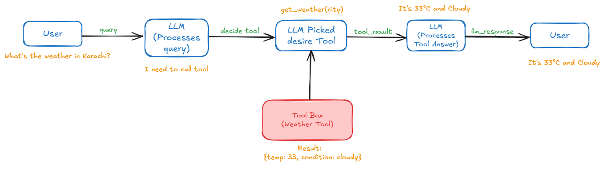

# Tools
OpenAI Agents SDK mein tools woh external functionalities hoti hain jo agents (AI models) ko real-world actions lene mein madad karti hain—jaise web se information lena, code chalana, aur system par tasks perform karna. Ye tools maksad se bhi use ho sakte hain, jese APIs, functions, ya automation tasks. Yeh teen ya chaar categories mein divide hotay hain:

* Hosted tools: these run on LLM servers alongside the AI models. OpenAI offers retrieval, web search and computer use as hosted tools.
* Function calling: these allow you to use any Python function as a tool.
* Agents as tools: this allows you to use an agent as a tool, allowing Agents to call other agents without handing off to them.


### Hosted tools
1. The WebSearchTool lets an agent search the web.
2. The FileSearchTool allows retrieving information from your OpenAI Vector Stores.
3. The ComputerTool allows automating computer use tasks.
4. The CodeInterpreterTool lets the LLM execute code in a sandboxed environment.
5. The HostedMCPTool exposes a remote MCP server's tools to the model.
6. The ImageGenerationTool generates images from a prompt.
7. The LocalShellTool runs shell commands on your machine.


### Visual Representation

---


### Tools Class
```bash
(variable) tools: list[FunctionTool | FileSearchTool | WebSearchTool | ComputerTool | HostedMCPTool | LocalShellTool | ImageGenerationTool | CodeInterpreterTool]
```

### Function tools / Function calling
You can use any Python function as a tool. The Agents SDK will setup the tool automatically:

* The name of the tool will be the name of the Python function (or you can provide a name)
* Tool description will be taken from the docstring of the function (or you can provide a description)
* The schema for the function inputs is automatically created from the function's arguments
* Descriptions for each input are taken from the docstring of the function, unless disabled

```python
@function_tool
def get_weather(city: str) -> str:
    
    """Get the current Weather of Karachi"""
    return f"{input},Weather is summy"


my_agent =  Agent(
    name="Assistance",
    instructions="you are a helpfull assistance, if your acked weather related question you want to call get_weather Tool",
    tools=[get_weather]
)
```

* agr me tool me doc string nh dunga to tool me jab bhi proper work kryga.
* llm ke pass function signature def get_weather(city: str) -> str: or function body jati.
* @function_tool function signature or dot string ki help sy fucntion schema banata ha or llm us function shemea ko he read krta ha

#### async Tool 
```python
@function_tool
async def get_weather(city: str) -> str:
    return f"The weather in {city} is sunny."
```   

##### @function_tool Class (decorator)
```python
(function)
def function_tool(
    func: ToolFunction[...],
    *,
    name_override: str | None = None,
    description_override: str | None = None,
    docstring_style: DocstringStyle | None = None,
    use_docstring_info: bool = True,
    failure_error_function: ToolErrorFunction | None = None,
    strict_mode: bool = True,
    is_enabled: bool | ((RunContextWrapper[Any], Agent[Any]) -> MaybeAwaitable[bool]) = True
) -> FunctionTool: ...
```

#### Name or description override
```python
@function_tool(name_override="my_weather_func",description_override="my_weather_desc")
def weather_tool(input:str)-> str:
    return f"{input} weather is sunny"
```
* tool ka name llm ke pass function name wala name jata ha agr issy change krna name_override ke perameter sy kr sakty ha.
* tool desc llm ke pass function doc string me jo likha hoga wo jaga description me. agr doc string nh de apny to description blank jayegi llm ke pass. agr ap issy change krna chahty hato description_override sy kr sakty ha.
* agr hum dot string dekr description_override me bhi description de to wo description_override ko llm ke pss bhjy ga.


## Agent as a Tool
In some workflows, you may want a central agent to orchestrate a network of specialized agents, instead of handing off control. You can do this by modeling agents as tools.

```python
# Define a support agent
poetry_agent = Agent(
    name="Poetry Writer Agent",
    instructions="Write a 3-stanza English poem on the given topic.",
    model=model
)

# Convert agents into tools
poetry_tool = poetry_agent.as_tool(
    tool_name="english_poetry_writer_tool",
    tool_description="Writes English poetry on the given topic."
)

triage_agent = Agent(
    name="Triage Agent",
    instructions="""
You are a smart assistant.
1. If the user asks for a poem or poetry, use 'english_poetry_writer_tool'.
2. Otherwise, use 'english_essay_writer_tool'.
Never write content yourself. Always call the right tool.
""",
    tools=[poetry_tool],
    model=model
)
```

### as_tools() Class
```python
(method) def as_tool(
    tool_name: str | None,
    tool_description: str | None,
    custom_output_extractor: ((RunResult) -> Awaitable[str]) | None = None
) -> Tool
```

### Agent as a Tool With is is_enabled 
```python
poetry_agent = Agent(
    name="Poetry Writer Agent",
    instructions="Write a 3-stanza English poem on the given topic.",
    model=model
)

triage_agent = Agent(
    name="Triage Agent",
    instructions="""
        You are a smart assistant.
        1. If the user asks for a poem or poetry, call the 'english_poetry_writer_tool'.
        2. Otherwise, respond that you're unable to assist.
        Never write content yourself.
    """,
    tools=[
        poetry_agent.as_tool(
        tool_name="english_poetry_writer_tool",
        tool_description="Writes English poetry on the given topic.",
        is_enabled=False,)
        ],
    model=model
)

result = Runner.run_sync(triage_agent, "Write a poem about the ocean.", run_config=config)
print(result.final_output)
```

**This is different from handoffs in two ways:**
1. In handoffs, the new agent receives the conversation history. In this tool, the new agent
receives generated input.
2. In handoffs, the new agent takes over the conversation. In this tool, the new agent is
called as a tool, and the conversation is continued by the original agent.This is different from handoffs in two ways:

* tool_name (required)
* tool_description (required)

* tool_name: The name of the tool. If not provided or "" Empty, the agent's name will be used.
* tool_description: The description of the tool, which should indicate what it does and when to use it.
* custom_output_extractor: A function that extracts the output from the agent. If not provided, the last message from the agent will be used.


#### Complete Code Example Agent As a Tool
```python
import os
from agents import Agent, Runner, AsyncOpenAI, OpenAIChatCompletionsModel,FileSearchTool
from dotenv import load_dotenv
import rich
from agents.run import RunConfig


load_dotenv()

gemini_api_key = os.getenv('GEMINI_API_KEY')

if not gemini_api_key:
    raise ValueError("Api key is loaded")

external_client = AsyncOpenAI(
    api_key=gemini_api_key,
    base_url="https://generativelanguage.googleapis.com/v1beta/openai/"
)


config = RunConfig(
 model= OpenAIChatCompletionsModel(model='gemini-2.0-flash',openai_client=external_client),
 model_provider=external_client,
 tracing_disabled=True   
)


shoping_agent =  Agent(
    name="Shoping_agent",
    instructions="you are assist user to finding products and making purchases decisions",
    model=OpenAIChatCompletionsModel(model='gemini-2.0-flash',openai_client=external_client),
    handoff_description='a shoping agent to help user in shoping.'
)

support_agnet =  Agent(
    name="support_agnet",
    instructions="you hlep user with post-purchase and return",
    model=OpenAIChatCompletionsModel(model='gemini-2.0-flash',openai_client=external_client),
    handoff_description='a support agent to help user in post-purchase queries.'
)


triage_agent =  Agent(
    name="triage agent",
    instructions=
    "you are a triage agent, you delegate task to approriate agent or use approriate given tools" 
    "when user asked for shoping related query, You always use given tools" 
    "You never reply on our own, You always use given tools to reply agent",
    model=OpenAIChatCompletionsModel(model='gemini-2.0-flash',openai_client=external_client),
    tools=[
        shoping_agent.as_tool(
            tool_name="transfer_to_Shoping_agent",
            tool_description="you are assist user to finding products and making purchases decisions always add this 💯 emojis in your reply.start reply eith this emoji 💯 emojie",
        ),
        
        support_agnet.as_tool(
            tool_name="transfer_to_support_agnet",
            tool_description="you hlep user with post-purchase and return. always add this ❌ emojis in your reply.start reply eith this emoji ❌ emojie"
        )
    ]
)

result = Runner.run_sync(starting_agent=triage_agent, input='i want to return by bag and 1 want to purchase a new bag',run_config=config)
rich.print(result.final_output)
```
* Lmm ke pass agent description or handoff_description apass me merge hokr jayengi.agr ap dono dety ho

### custom_output_extractor
Jab tum ek agent ko as_tool method ke zariye tool ke tor par use karte ho, to woh tool ek specific output deta hai. Lekin kabhi-kabhi, tumhe us output ko apne hisaab se process ya modify karna hota hai, taake woh doosre agent ke liye ziyada mufeed ho. Yahan custom_output_extractor kaam aata hai.<br>
custom_output_extractor ek optional function hai jo tum as_tool method mein pass kar sakte ho. Yeh function RunResult (jo agent ka output hota hai) ko leta hai aur usse ek customized string ya output return karta hai.

* Yeh parameter tumhe yeh control deta hai ke agent ke output mein se kaunsa hissa extract karna hai ya usay kaise format karna hai.
* Yeh ek tarah ka filter ya transformer hai jo raw output ko tumhare chahay hue format mein badalta hai.

```python
from agents import RunResult
import re

async def extract_temperature(result: RunResult) -> str:
    print("Raw output:", result.final_output) 
    
    # Regex se temperature extract karo
    match = re.search(r"temperature[s]? around (\d+)°C|temperatures hitting (\d+)°C", result.final_output, re.IGNORECASE)
    if match:
        # Agar "temperatures around 32°C" milta hai, to group(1) lo, warna group(2)
        temp = match.group(1) if match.group(1) else match.group(2)
        return f"The temperature is {temp}°C"
    return "Error: Could not extract temperature"

agent_tool = agent_two.as_tool(
    tool_name="custom_weather_tool",
    tool_description="this is a custom tool",
    custom_output_extractor=extract_temperature
)

agent = Agent(
    name="CrashAgent",
    instructions="If asked anything, use agent_tool.",
    model=OpenAIChatCompletionsModel(model="gemini-2.0-flash", openai_client=external_client),
    tools=[agent_tool]
)

result = Runner.run_sync(starting_agent=agent, input="What is the weather in karachi")
```


#### Customizing tool-agents
```python
from agents import Agent, Runner, function_tool

@function_tool
async def run_my_agent(input: str) -> str:
    """Runs a sub-agent with custom config and input."""

    agent = Agent(
        name="My Agent",
        instructions="You help users by translating text to French."
    )

    result = await Runner.run(
        agent,
        input=input,
        max_turns=5 # max_turns = 5 ka matlab hai ke agent sirf 5 dafa LLM call karega ya tools use karega jab tak final output produce ho. bydefault max turn 10 hoti ha
    )

    return str(result.final_output)
```

### Custom output extraction
In certain cases, you might want to modify the output of the tool-agents before returning it to the central agent. This may be useful if you want to:

* Extract a specific piece of information (e.g., a JSON payload) from the sub-agent's chat history.
* Convert or reformat the agent’s final answer (e.g., transform Markdown into plain text or CSV).
* Validate the output or provide a fallback value when the agent’s response is missing or malformed.

You can do this by supplying the custom_output_extractor argument to the as_tool method:

### Custom function tools
Sometimes, you don't want to use a Python function as a tool. You can directly create a FunctionTool if you prefer. You'll need to provide:
* name
* description
* params_json_schema, which is the JSON schema for the arguments
* on_invoke_tool, which is an async function that receives a ToolContext and the arguments as a JSON string, and must return the tool output as a string.


#### 1. Handoff vs As Tool
The key difference here revolves around what context is passed to the new agent and how control of the conversation flows between agents. Let’s break down each point:

* Handoffs:
When an agent uses a handoff, the new (receiving) agent is given the entire conversation history. This means that it gets every message—user input, previous responses, tool calls, and any context that has been built up so far. This comprehensive context allows the new agent to fully understand the background, nuances, and prior decisions of the conversation. It’s as if the conversation “moves” entirely over to the new agent, which can then generate responses based on all of the earlier dialogue.

* Tool-based Calls (using as_tool):
In contrast, when an agent is invoked as a tool (using the as_tool method), it does not receive the whole conversation history. Instead, it gets a piece of generated input from the original agent—often a specific string or a data payload that was produced during the conversation. The new agent (now acting as a tool) only processes this discrete input. This design is useful when the new agent’s functionality is meant to handle a specific task or computation without needing the full background, thereby keeping the interface simpler and more focused.

#### 2. . Flow of Conversation Control
* Handoffs:
In a handoff, the new agent “takes over” the conversation. Because it receives the full history, it continues the interaction as if it were the main agent, making decisions, asking follow-up questions, or generating responses based solely on the transferred dialogue. Essentially, the conversational control is completely passed to the new agent, which now becomes responsible for driving the dialogue forward.

* Tool-based Calls (using as_tool):
When an agent is used as a tool, it is invoked by the original agent to perform a specific function (for example, processing data or executing a sub-task). After the tool (the new agent) completes its job and returns its output, the original agent resumes the conversation. The original agent integrates the tool’s result into the ongoing dialogue, which means it maintains overall control of the conversation flow. This approach allows for modularity—different agents can be “plugged in” to perform functions without completely transferring the conversational context or control.


#### 3. Why This Distinction Matters
* Modularity and Reusability:
Using the tool method (via as_tool) is ideal for building systems where you want to keep the conversation centralized. The original agent can call upon various specialized sub-agents (tools) for tasks like calculations, look-ups, or processing requests, then stitch their outputs back into a coherent conversation. This leads to a highly modular design where each agent can be developed and maintained independently while still contributing to a unified interaction.

* Context-Rich Delegation:
Handoffs, on the other hand, are best suited for scenarios where the new agent must have a complete understanding of the conversation to address complex or nuanced issues. This might be important in customer support or when the conversation’s history carries essential details that affect subsequent responses.


#### An Analogy
Imagine you’re at a restaurant:

* Handoff: If you ask the host to call the chef over because your dish needs a complete rework, the chef comes over with full knowledge of everything that’s happened (the conversation history, complaints, previous interactions) and takes over your service.
* Tool Call: Instead, if you ask the waiter to bring a side dish, the waiter simply takes your specific request (the generated input) and returns with the dish. You, as the diner, still engage directly with the waiter, who integrates that dish into your meal.


# Web Search Tool (Using with Open Ai API Key)
```python
from agents import Agent, Runner, WebSearchTool
import rich

my_agent =  Agent(
    name="Assistance",
    instructions="you are a helpfull assistance, if your acked weather related question you want to call get_weather Tool",
    tools=[WebSearchTool()],
)

result = Runner.run_sync(starting_agent=my_agent, input='Current weather in karachi',run_config=config)
rich.print(result.final_output)
```

# File Search Tool (Usinh with Open Ai API Key)

1. first of create data.txt in nodepad

**data.txt file content**
```python
name:hussain
std_id : 3423534634
```
2. Goto the openai dashboard-->storage goto to vector_stores and create vector_stores and (upload) data.txt file here
and copy vector_stores id

```python
from agents import Agent, Runner, WebSearchTool
import rich

my_agent =  Agent(
    name="Assistance",
    instructions="you are a helpfull assistance, if your acked weather related question you want to call get_weather Tool",
    tools=[FileSearchTool(
        max_num_results=3,
        vector_store_ids="Vector_store_id"  # paste 
    
    )],
)
result = Runner.run_sync(starting_agent=my_agent, input='What is the std_id of hussain',run_config=config)
rich.print(result.final_output)


```