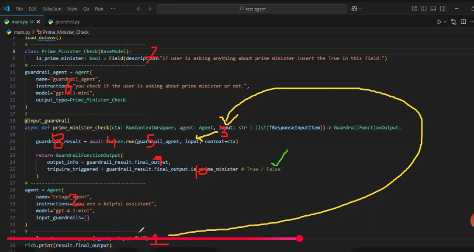

# Guardrails
Guardrails run in parallel to your agents, enabling you to do checks and validations of user input. For example, imagine you have an agent that uses a very smart (and hence slow/expensive) model to help with customer requests. You wouldn't want malicious users to ask the model to help them with their math homework. So, you can run a guardrail with a fast/cheap model. If the guardrail detects malicious usage, it can immediately raise an error, which stops the expensive model from running and saves you time/money.

**There are two kinds of guardrails:**

* Input guardrails run on the initial user input
* Output guardrails run on the final agent output

### Input guardrails
Input guardrails run in 3 steps:
1. First, the guardrail receives the same input passed to the agent.
2. Next, the guardrail function runs to produce a GuardrailFunctionOutput, which is then wrapped in an InputGuardrailResult
3. Finally, we check if .tripwire_triggered is true. If true, an InputGuardrailTripwireTriggered exception is raised, so you can appropriately respond to the user or handle the exception.


* Kya Hota Hai?: Guardrail function input ko process karta hai aur ek GuardrailFunctionOutput object return karta hai. Ye output batata hai ke input valid hai ya nahi, aur agar koi issue hai to kya issue hai.
* GuardrailFunctionOutput ko ek InputGuardrailResult object mein wrap kiya jata hai, jo final result ko standardize karta hai taake system usse easily handle kar sake.


Input guardrails are intended to run on user input, so an agent's guardrails only run if the agent is the first agent. You might wonder, why is the guardrails property on the agent instead of passed to Runner.run? It's because guardrails tend to be related to the actual Agent - you'd run different guardrails for different agents, so colocating the code is useful for readability.

### Output guardrails
Output guardrails run in 3 steps:

1. First, the guardrail receives the output produced by the agent.
2. Next, the guardrail function runs to produce a GuardrailFunctionOutput, which is then wrapped in an OutputGuardrailResult
3. Finally, we check if .tripwire_triggered is true. If true, an OutputGuardrailTripwireTriggered exception is raised, so you can appropriately respond to the user or handle the exception.

Output guardrails are intended to run on the final agent output, so an agent's guardrails only run if the agent is the last agent. Similar to the input guardrails, we do this because guardrails tend to be related to the actual Agent - you'd run different guardrails for different agents, so colocating the code is useful for readability.

[Output guardrail](./output-guardrail.md)

### Tripwires
If the input or output fails the guardrail, the Guardrail can signal this with a tripwire. As soon as we see a guardrail that has triggered the tripwires, we immediately raise a {Input,Output}GuardrailTripwireTriggered exception and halt the Agent execution.


### input guardrails Code

* InputGuardrail me bydeafault empty list hoti ha. (ye empty list craete kryga--> field(default_factory=list))
```bash
input_guardrails: list[InputGuardrail[TContext]] = field(default_factory=list)
```

* @input_guardrail decorator pr Click kro ye methods InputGuardrail return kr raha ha..
```bash
@overload
def input_guardrail(
    func: _InputGuardrailFuncSync[TContext_co],
) -> InputGuardrail[TContext_co]: ...
```

* Guardrail ko craete krny ke liye ye structure fllow krna hoga (click @input_guardrail decorator and click InputGuardrail you will see
```bash
 guardrail_function: Callable[
        [RunContextWrapper[TContext], Agent[Any], str | list[TResponseInputItem]],
        MaybeAwaitable[GuardrailFunctionOutput],
    ]
    """A function that receives the agent input and the context, and returns a
     `GuardrailResult`. The result marks whether the tripwire was triggered, and can optionally
     include information about the guardrail's output.
    """
```

#### Create
* humny eik input_guardrail create kia ha structure ke according
```bash
@input_guardrail
def prime_minister_check(ctx: RunContextWrapper,agent:Agent,input: str | list[TResponseInputItem]) -> GuardrailFunctionOutput:
    
    return GuardrailFunctionOutput()
```

* return jo ho raha ha GuardrailFunctionOutput() 
* ye function ha jo 2 perameters le raha ha 
```bash
class GuardrailFunctionOutput(
    output_info: Any,
    tripwire_triggered: bool
)
```
**InputGuardrail Class me (Jaha Guardrail create waha Structure mojjod ha)**
* waha eik run ka function ha jo guardrail jo run kryga or InputGuardrailResult ki class return kryga us Class ka structure
```bash
async def run(
        self,
        agent: Agent[Any],
        input: str | list[TResponseInputItem],
        context: RunContextWrapper[TContext],
    ) -> InputGuardrailResult:
        if not callable(self.guardrail_function):
            raise UserError(f"Guardrail function must be callable, got {self.guardrail_function}")

        output = self.guardrail_function(context, agent, input)
        if inspect.isawaitable(output):
            return InputGuardrailResult(
                guardrail=self,
                output=await output,
            )

        return InputGuardrailResult(
            guardrail=self,
            output=output,
        )
```
* run function call krty wqt agent,input or context required ha pass krna.

##### code
```bash
import asyncio
import os
from agents import (
    Agent, Runner, AsyncOpenAI, OpenAIChatCompletionsModel, input_guardrail, GuardrailFunctionOutput,
    RunContextWrapper,TResponseInputItem
)
from dotenv import load_dotenv
import rich
from pydantic import BaseModel,Field


load_dotenv()

gemini_api_key = os.getenv('GEMINI_API_KEY')
if not gemini_api_key:
    raise ValueError("API key is not loaded")

external_client = AsyncOpenAI(
    api_key=gemini_api_key,
    base_url="https://generativelanguage.googleapis.com/v1beta/openai/"
)


class Prime_minster_Check(BaseModel):
    is_prime_minister: bool = Field(description="if your is acking anything about prime minister the True in this field")
    

guardrail_agent =  Agent(
    name="guardrail_agent",
    instructions='you check if the user is acking about prime minister or not',
    model=OpenAIChatCompletionsModel(model='gemini-2.0-flash',openai_client=external_client),
    output_type=Prime_minster_Check
)


@input_guardrail
async def prime_minister_check(ctx: RunContextWrapper, agent:Agent,input: str | list[TResponseInputItem]) -> GuardrailFunctionOutput:
    
    guardrail_result = await Runner.run(guardrail_agent,input,context=ctx)
    
    return GuardrailFunctionOutput(
        output_info=guardrail_result.final_output,
        tripwire_triggered=guardrail_result.final_output.is_prime_minister # Ture / False
    )

myagent =  Agent(
    name="assistance",
    instructions='you are a helpfull Assistance',
    model=OpenAIChatCompletionsModel(model='gemini-2.0-flash',openai_client=external_client),
    input_guardrails=[prime_minister_check]
)
    
async def main():
    result = await Runner.run(starting_agent=myagent, input="what is the prime misiter od pakistan")
    print(result.final_output)
    
asyncio.run(main())
```
* jasy tripwire_triggered True hoga to  InputGuardrailTripwireTriggered ki class sy (Guardrail InputGuardrail triggered tripwire) ka error ayega
* TResponseInputItem ka mtlb ha input is format he ho sakta ha 
```bash
user = {"role" : "user" , "content" : "hi how are you"}
```

##### Guardrail runing Flow



### With Exception Handling
```bash
async def main():
    
    try:
        result = await Runner.run(starting_agent=myagent, input="what is the prime misiter od pakistan")
        print(result.final_output)
    
    except InputGuardrailTripwireTriggered as e:
        print(f"GUARDRAIL ERROR {e}")
            
asyncio.run(main())
```