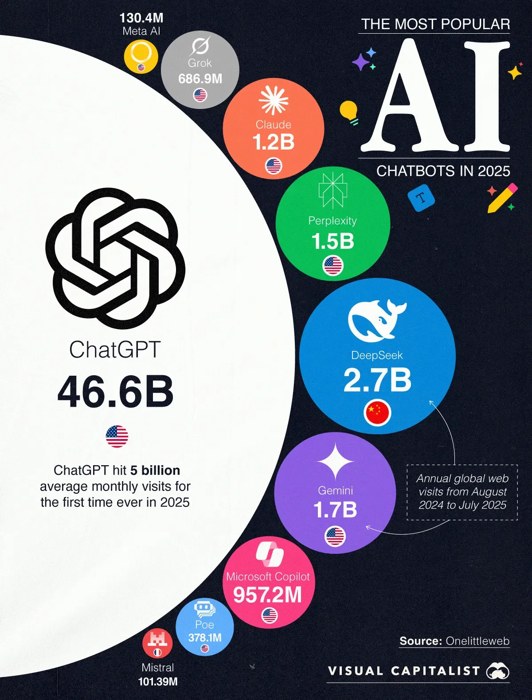
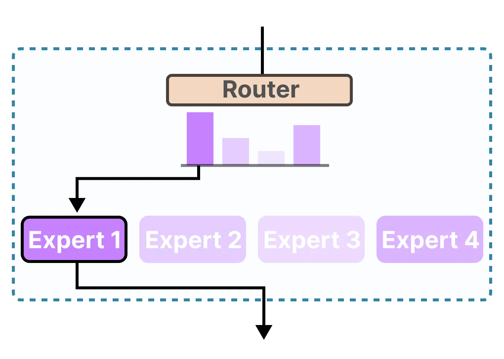

* With 46.59B visits, ChatGPT accounts for more than 83% of total traffic among the top 10 chatbots.
* The second most-used chatbot, DeepSeek at 2.74B visits, has barely 6% of ChatGPT’s traffic.
* While traffic is concentrated, the list includes a mix of U.S., Chinese, and European players.

---

### Which is the best LLM?
See how leading models stack up across text, image, vision, and beyond. This page gives you a snapshot of each Arena:<br>
https://lmarena.ai/leaderboard

---

### How LLM Works
How LLMs Work: Top 10 Executive-Level Questions: <br>
https://sloanreview.mit.edu/article/how-llms-work/


### We Eill use this model for prompt and context engineering
1. chatgpt
2. gemini
3. colud
4. grok

---

### Use these Prompt Engineering Tools to Learn
* https://platform.openai.com/chat/
* https://aistudio.google.com/
* https://console.anthropic.com/


## Table of Contents

1. [What is Prompt Engineering?](#what-is-prompt-engineering)
2. [Understanding Large Language Models](#understanding-large-language-models)
3. [Essential Configuration Settings](#essential-configuration-settings)
4. [Fundamental Prompting Techniques](#fundamental-prompting-techniques)
5. [Advanced Prompting Strategies](#advanced-prompting-strategies)
6. [Best Practices for Effective Prompts](#best-practices-for-effective-prompts)
7. [Common Pitfalls and How to Avoid Them](#common-pitfalls-and-how-to-avoid-them)
8. [Hands-On Examples](#hands-on-examples)
9. [Testing and Iteration](#testing-and-iteration)
10. [Resources and Next Steps](#resources-and-next-steps)
11. [Mixture-of-Experts (MoE) and Prompt Engineering](#mixture-of-experts-moe-and-prompt-engineering)
12. [The 6-Part Prompting Framework](https://github.com/skhussain123/OPENAISDK-TEST_PREPRATION/tree/main/Prompt-%26-Context-Engineering/02-six-part-prompting)


### Prompt Coach
Here’s a reusable “Prompt Coach” prompt you can keep handy. You’ll paste this into ChatGPT (or any LLM), then just drop in your messy idea, and it will rewrite it into a polished, effective prompt for you:

Copy Paste this in your LLM:
```bash
You are my Prompt Coach. I will give you a rough or unclear prompt. 
Your task is to:
1. Clarify it
2. Add missing context
3. Structure it for best results
4. Suggest 2–3 alternative versions (different styles: simple, detailed, structured)

Here’s my rough prompt: [INSERT YOUR PROMPT HERE]
```


---
## What is Prompt Engineering?
Prompt engineering is the art and science of crafting instructions that guide AI language models to produce desired outputs. Think of it as learning to communicate effectively with AI systems to achieve specific goals.

**Why is it important?**
* You don't need to be a programmer to use AI effectively
* Good prompts can dramatically improve AI performance
* It's an iterative skill that improves with practice
* It's becoming essential for productivity in many fields


## Context engineering 
Context engineering is the process where, instead of just giving the AI model a prompt, we also provide all the necessary background information, rules, constraints, or scenarios so the model can correctly understand our query and give a relevant, accurate, and targeted response

Context engineering means providing a large language model (LLM) with the external information or background details it needs to better understand your query and give the correct response. Telling the model what kind of external elements (like specific data, scenarios, or constraints) to use and how to use them is called context engineering.

Simple definition: It’s about giving the LLM a framework or guide so that, while answering your question, it knows what to consider, what to focus on, and how to process it. The goal is to make the model’s output more relevant and accurate.


### Prompt engineering vs. context engineering
Prompt engineering = crafting the instruction you give the model. Context engineering = curating the information the model can see when following that instruction.


### Quick contrast

| Aspect          | Prompt engineering                                                       | Context engineering                                                                      |
| --------------- | ------------------------------------------------------------------------ | ---------------------------------------------------------------------------------------- |
| Goal            | Tell the model *how* to behave and *what* to produce                     | Give the model the *facts/examples* it should rely on                                    |
| Levers          | Wording, structure, roles, constraints, output schema, few-shot examples | Retrieval (RAG), documents, knowledge bases, tools/APIs, memory, state across turns      |
| Typical changes | “Be concise. Return valid JSON with fields X/Y/Z.”                       | “Attach the company glossary, latest policy PDF, and retrieved passages for this query.” |
| Failure mode    | Vague instructions → messy/incorrect format                              | Missing/irrelevant info → hallucinations/outdated answers                                |
| Ownership       | UX/prompt designers, app devs                                            | Data/ML/platform teams (pipelines, indexing, chunking, evals)                            |

### How they work together

* Start with a **good prompt**: clear task, constraints, and an **output contract** (e.g., JSON schema).
* Then **ground it with context**: supply only the *most relevant* passages, tables, and tool results.
* The prompt guides *behavior*; the context supplies *knowledge*. You usually need both.

### Concrete examples

1. **Invoice → JSON extractor**

* *Prompt engineering*: “Extract fields {vendor, date, total}. Return JSON only. If a field is missing, use null.”
* *Context engineering*: Provide a few labeled examples and attach the vendor’s invoice spec retrieved via embeddings.

2. **Policy Q\&A bot**

* *Prompt engineering*: “Answer using the attached passages; if unsure, say ‘Not in policy.’ Cite section IDs.”
* *Context engineering*: RAG over your policy repo (chunking, metadata filters like `department=HR`, freshness boosts), plus a recency cache for updates.

3. **Agentic workflow**

* *Prompt engineering*: Tool-use instructions and function signatures.
* *Context engineering*: Feed tool responses (DB rows, API payloads) back into the context window each step; maintain short-term memory/state.

### Practical tips

* Keep prompts **short, specific, and testable**; define output schemas.
* Prefer **few-shot** examples only when they generalize; otherwise move them into **retrieval**.
* For context: optimize **chunking**, **ranking**, **deduping**, and **token budgets**; log what was retrieved for each answer.
* Add **citations** and “answer only from context” instructions when correctness matters.
* Evaluate both layers separately: prompt A/B tests and retrieval quality (precision/recall, groundedness).

One-liner: Prompt engineering is how you ask; context engineering is what you show. Combine them for reliable, scalable LLM apps.

---

## Understanding Large Language Models
#### How LLMs Work (The Basics)
Large Language Models are prediction engines that:
* Take text input (your prompt)
* Predict the next most likely word/token
* Continue this process to generate complete responses
* Base predictions on patterns learned from training data


#### Key Concept: Autocompletion
LLMs don't "understand" in the human sense—they're sophisticated autocomplete systems. Your prompt sets up the context for what should come next.


## Essential Configuration Settings
Before diving into prompt techniques, understand these key parameters that control AI behavior:

### Temperature (0-1)
* Low (0-0.3): Focused, consistent, deterministic responses
* Medium (0.4-0.7): Balanced creativity and consistency
* High (0.8-1.0): Creative, diverse, but potentially unpredictable

**When to use:**
* Temperature 0: Math problems, factual questions
* Temperature 0.7: Creative writing, brainstorming
* Temperature 0.9: Poetry, experimental content

### Output Length/Token Limits
* Controls maximum response length
* Higher limits = more computational cost
* Set appropriately for your task needs

### Top-K and Top-P (Nucleus Sampling)
* Top-K: Limits choices to top K most likely tokens
* Top-P: Limits choices based on cumulative probability
* Work together with temperature to control randomness

#### Recommended starting points:
* Conservative: Temperature 0.1, Top-P 0.9, Top-K 20
* Balanced: Temperature 0.2, Top-P 0.95, Top-K 30
* Creative: Temperature 0.9, Top-P 0.99, Top-K 40

# 1. Fundamental Prompting Techniques
### 1. Zero-Shot Prompting
* The simplest approach—just ask directly without examples.
<br>
Zero-shot prompting means giving the AI a task without providing any example or prior training. You only give clear instructions, and the AI responds using its general knowledge. In other words, the AI isn’t shown any example for the task — it’s simply told what to do.


**Example:**
```
Classify this movie review as positive, negative, or neutral:
"The film was visually stunning but the plot felt rushed."
```

**When to use:**
- Simple, well-defined tasks
- When the model has clear knowledge of the domain
- Quick one-off requests

### 2. One-Shot Prompting
* Provide a single example to guide the response format.
<br>
One-shot prompting is a method where you give the AI a task and provide just one example to help it understand. It’s different from zero-shot because zero-shot doesn’t include any example, and it’s different from few-shot because few-shot includes multiple examples. In one-shot prompting, you give only one example so the AI can understand the task better and respond in a similar way.

**Example:**
```
Translate English to French:

English: "Hello, how are you?"
French: "Bonjour, comment allez-vous?"

English: "Where is the library?"
French:
```

### 3. Few-Shot Prompting
* Provide multiple examples to establish a clear pattern.
<br>
Few-shot prompting is a method where you give the AI a task along with multiple examples so it can clearly understand the style, tone, or format and respond in the same way. It’s different from zero-shot (no examples) and one-shot (one example) because in few-shot prompting, you provide two or more examples. This helps the AI better understand the pattern of the task.


**Example:**
```
Convert customer feedback to structured data:

Feedback: "Great service, but food was cold"
JSON: {"service": "positive", "food": "negative", "overall": "mixed"}

Feedback: "Amazing experience, will definitely return"
JSON: {"service": "positive", "food": "positive", "overall": "positive"}

Feedback: "Terrible food and rude staff"
JSON:
```

**Best practices:**
- Use 3-5 examples for most tasks
- Include diverse examples
- Mix up the classes in classification tasks
- Ensure examples are high-quality and consistent

### 4. System Prompting
* Set overall context and behavior guidelines.
<br>
System prompting ek tareeka hai jismein aap AI ko ek high-level instruction ya role dete hain jo uske overall behavior ya tone ko define karta hai. Yeh prompt task-specific nahi hota, balki AI ke liye ek general framework ya personality set karta hai jo uske tamam jawabon pe asar daalta hai. System prompt aksar AI ke developers ya platform designers dete hain taake AI ka behavior consistent aur user ke maqsad ke mutabiq rahe.


**Example:**
```
You are a helpful travel guide. Provide practical, accurate information about destinations. Always include:
- Key attractions
- Local customs to be aware of
- Budget considerations
- Best time to visit

User: Tell me about visiting Tokyo.
```

### 5. Role Prompting

Assign a specific character or expertise to the AI.

**Example:**
```
Act as an experienced software architect. I need help designing a scalable web application for 1 million users. What architecture patterns should I consider?
```

**Effective roles:**
- Subject matter expert (doctor, lawyer, teacher)
- Creative roles (writer, designer, poet)
- Analytical roles (data analyst, consultant)
- Communication styles (friendly tutor, formal advisor)

### 6. Contextual Prompting
* Provide specific background information relevant to the task.
<br>
Contextual prompting is a method where you give an AI a task along with the necessary background information, data, or context so that the AI’s response is more accurate, specific, and aligned with your objective. It goes beyond just giving instructions; it includes external details, constraints, or scenarios that guide the AI’s answer. This is a part of context engineering, which focuses on providing relevant information so the AI can understand properly and respond correctly.

**Example:**
```
Context: You're writing for a tech blog aimed at beginners who have never coded before.

Write a 200-word explanation of what an API is, using simple language and practical examples.
```

# 2. Advanced Prompting Strategies

### 1. Chain of Thought (CoT) Prompting

Encourage step-by-step reasoning for complex problems.

**Example:**
```
Solve this step by step:
If I was 6 when my sister was half my age, how old is my sister when I'm 40?

Let me think through this step by step:
```

**When to use:**
- Math problems
- Logical reasoning
- Complex analysis
- Multi-step processes

**Best practices:**
- Use "Let's think step by step" or similar phrases
- Set temperature to 0 for consistent reasoning
- Extract final answers separately from reasoning

### 2. Self-Consistency
* Generate multiple reasoning paths and select the most common answer.
* You solve the same question using different reasoning approaches (linear, one-by-one). Then you compare the answers and pick the one that appears most often.
<br>
Self-consistency is a technique in which an AI generates answers for the same question or task using multiple different reasoning paths, and then selects the response that appears most frequently or is the most consistent. This method is especially used when there may be variability in the AI’s answers, or when you want a more reliable and accurate response. It reduces uncertainty and improves the quality of the output.

**Process:**
1. Ask the same question multiple times with different phrasings
2. Compare the answers
3. Choose the most frequently occurring result

**Example:**
```
Question: If a store offers a 20% discount on a $50 item, what is the final price?

Generate 3 different reasoning paths for this question and select the most consistent answer.

Path 1: To find the final price, calculate the discount: 20% of $50 is 0.20 × 50 = $10. Subtract this from the original price: $50 - $10 = $40. The final price is $40.

Path 2: A 20% discount means paying 80% of the original price. So, 80% of $50 is 0.80 × 50 = $40. Therefore, the final price is $40.

Path 3: Compute the discount amount: 20% = 0.20, so 0.20 × $50 = $10 off. The original price is $50, so after the discount, it’s $50 - $10 = $40. The final price is $40.

Most common answer: $40
```

**Explanation of Concept:**
Self-Consistency involves generating multiple answers to the same question using varied reasoning approaches to ensure reliability. By comparing the results, you select the most frequent or consistent outcome, reducing the chance of errors from a single flawed reasoning path. This method leverages the model's ability to approach the problem from different angles, increasing confidence in the final answer when all paths converge, as seen here with the consistent result of $40.

### 3. Step-Back Prompting
* Ask a more general question first, then use that context for the specific question.
<br>
Step-back prompting is a technique where you first ask the AI a broad or general question so that the foundational knowledge or principles needed for the task become clear. Then, using that knowledge as context, you ask the specific question. This two-step process helps the AI give more structured, informed, and accurate responses, because it first understands the key aspects of the task through the broader context.


**Example 1:**
```
First, what are the key principles of good user interface design?

[Get response]

Now, using those principles, redesign this mobile app's login screen: [description]
```

**Example 2:**
Question: How should I optimize the loading speed of my e-commerce website?
```
Step 1: First, what are the key factors that generally affect website loading speed?

Response: Key factors include:
- Server response time (hosting quality, server location)
- Image and asset optimization (file size, compression)
- Code efficiency (minifying CSS/JavaScript, reducing HTTP requests)
- Caching strategies (browser caching, CDNs)
- Third-party scripts (ads, analytics)

Step 2: Using these factors, provide specific recommendations to optimize the loading speed of an e-commerce website with heavy product images and multiple third-party plugins.

Response:
1. **Server Optimization**: Choose a reliable hosting provider with servers close to your audience. Enable server-side caching (e.g., Redis or Varnish).
2. **Image Optimization**: Compress product images using formats like WebP. Implement lazy loading to defer off-screen images.
3. **Code Efficiency**: Minify CSS and JavaScript files. Combine small files to reduce HTTP requests.
4. **Caching**: Use a Content Delivery Network (CDN) like Cloudflare to cache static content globally. Set browser cache headers for repeat visitors.
5. **Third-Party Plugins**: Audit and remove unnecessary plugins. Asynchronously load scripts for analytics or ads to avoid blocking page rendering.

```

**Explanation of Concept:**
Step-Back Prompting involves first asking a broader, foundational question to establish key principles or context before tackling the specific task. This approach ensures the model grounds its response in general knowledge (e.g., factors affecting website speed) before applying it to the specific problem (e-commerce site optimization). By breaking the task into two steps, the model produces more informed and structured recommendations, reducing the risk of overlooking critical factors.


---

### 4. ReAct (Reasoning + Acting)
ReAct ka matlab hai Reasoning + Acting — yaani AI ya agent pehle sochta hai (reasoning), phir koi action leta hai (tool use, search, calculation, etc.), phir dobara soch ke next step decide karta hai.
* Combine reasoning with tool use or actions.

ReAct means Reasoning + Acting, meaning the AI first thinks (reasoning) about how to solve the task, then takes an action (such as using a tool, doing a web search, or making a calculation), and after that, based on the observation, it thinks again and decides the next step. It’s an iterative process in which the AI combines reasoning and actions to solve complex problems step by step.

ReAct ek prompting strategy hai jo reasoning (soch) aur actions (tools, searches) ko combine karta hai taake complex tasks step-by-step solve ho sakein. Yeh iterative cycle (Thought-Action-Observation) follow karta hai, jo accuracy aur reliability barhata hai, khas kar jab external data ya multi-step verification chahiye.

**Example 1**
```bash
I need to find out how many children the members of Metallica have in total.

Thought: I need to find information about each band member and their children.
Action: Search for "Metallica band members"
Observation: [results]
Thought: Now I need to search for each member individually...
```

**Example 2**
```bash
Question: What is the current population of Tokyo, and how does it compare to New York City?

Thought: I need to find the current population of Tokyo and New York City to compare them. I should start by searching for the latest population data for Tokyo.

Action: web_search
<parameter name="query">current population of Tokyo 2025</parameter

Observation: [Assume tool response: According to recent estimates, Tokyo's population in 2025 is approximately 37.4 million in the metropolitan area.]

Thought: Now I have Tokyo's population. Next, I need the population for New York City.

Action: web_search
<parameter name="query">current population of New York City 2025</parameter

Observation: [Assume tool response: New York City's metropolitan area population in 2025 is estimated at about 23.6 million.]

Thought: With both figures, I can compare them. Tokyo has a larger population than New York City by about 13.8 million people.

Final Answer: Tokyo's population is approximately 37.4 million, compared to New York City's 23.6 million, making Tokyo significantly larger.
```
Explanation of Concept: ReAct (Reasoning + Acting) is a prompting strategy that interleaves reasoning steps (Thoughts) with actions (tool calls or external queries) to solve complex problems iteratively. Each cycle includes a Thought (planning the next step), an Action (executing a tool or search), and an Observation (processing the result). This loop continues until the question is resolved, allowing the model to dynamically gather information and refine its approach. It's particularly useful for tasks requiring real-time data or multi-step verification, as demonstrated by sequentially fetching and comparing population data.

**Example 3**
```bash
if a book cost 200 pkr and i get 10% discount, how should we write a ReAct prompt to solve it 
step by step?

---

**ReAct Prompt**
You are tasked with solving the following problem using the ReAct (Reasoning and Acting) framework. The problem is: A book costs 200 PKR, and you get a 10% discount. What is the final price after the discount?

Follow these steps:
1. **Observation**: Restate the problem in your own words to confirm understanding.
2. **Reasoning**: Explain the logical steps needed to solve the problem. Break it down into clear, sequential steps.
3. **Action**: Perform the necessary calculations or actions based on your reasoning. Show all work clearly.
4. **Evaluation**: Verify your calculations or reasoning to ensure correctness. If needed, consider alternative methods to confirm the result.
5. **Final Answer**: Provide the final answer in a clear, concise format.

Use the following format for your response:

[Observation]
[Your observation here]

[Reasoning]
[Your reasoning here]

[Action]
[Your calculations or actions here]

[Evaluation]
[Your evaluation here]

[Final Answer]
[Your final answer here]


```

---

### 5. Tree of Thoughts (ToT)
* Explore multiple reasoning branches simultaneously for complex problems.
* Instead of straight lines, you explore branches like a decision tree. Each step can lead to multiple next possibilities. You evaluate ideas along the way and continue only promising branches.
<br>
Tree of Thoughts (ToT) is an advanced prompting technique in which the AI explores multiple reasoning paths or branches—like a tree structure—to solve a complex problem. Each branch represents a different approach or idea, and the AI evaluates these branches to choose the best solution. This method is especially useful for complex, multi-step, or creative problems where a single linear approach is not sufficient.

**When to use:**
- Creative problem solving
- Strategic planning
- Complex decision-making
- Tasks requiring exploration of alternatives


**Example : 1**

Question: What is the best marketing strategy for launching a new eco-friendly clothing brand targeting young adults?

Task: Explore multiple strategic approaches, evaluate them, and select the best one.

**Branch 1: Social Media Campaign**
Thought: Young adults are active on platforms like Instagram and TikTok. A campaign using influencers could build brand awareness.
Exploration:
- Pros: High engagement, visually appealing for clothing, cost-effective with micro-influencers.
- Cons: Risk of inauthentic partnerships, oversaturation in influencer marketing.
Evaluation: Strong for visibility but needs unique content to stand out. Score: 8/10.

**Branch 2: Sustainable Pop-Up Events**
Thought: Hosting pop-up shops at eco-conscious festivals or college campuses could create direct engagement.
Exploration:
- Pros: Hands-on experience with products, builds community, aligns with eco-friendly values.
- Cons: High logistical costs, limited geographic reach.
Evaluation: Great for brand authenticity but resource-intensive. Score: 7/10.

**Branch 3: Collaborative Partnerships**
Thought: Partnering with eco-friendly brands (e.g., sustainable accessories) could cross-promote to aligned audiences.
Exploration:
- Pros: Expands reach via partner networks, reinforces eco-mission.
- Cons: Complex coordination, potential brand dilution.
Evaluation: Effective for niche targeting but requires careful partner selection. Score: 7.5/10.

**Synthesis**: Combine a social media campaign (Branch 1) with selective pop-up events (Branch 2) for maximum impact. Use partnerships (Branch 3) to amplify reach at events.

Final Strategy: Launch with a TikTok influencer campaign showcasing eco-friendly clothing, paired with pop-up shops at green festivals to engage young adults directly. Collaborate with a sustainable accessory brand to co-promote at events.


**Explanation of Concept:**
Tree of Thoughts (ToT) involves generating multiple reasoning branches to explore different solutions to a problem, evaluating each, and synthesizing the best ideas into a final answer. Each branch represents a distinct approach, which is explored, assessed for pros and cons, and scored. This method is ideal for complex, open-ended tasks like strategic planning, as it encourages creative exploration and systematic comparison, as shown in the marketing strategy example above.


**Example 2**
```bash
Answer in Tree of Thoughts style. Create at least 3 reasoning branches to solve the problem. In each branch, include:

Thought

Pros

Cons

Score (out of 10)

After evaluating the branches, select the best one (or a combination of them) and give the Final Answer at the end.

Problem:
I want to start a YouTube channel but I can’t decide which niche (topic) to focus on. Explore multiple options and suggest the best one.”**
```

---

# 3. Best Practices for Effective Prompts

### 1. Be Specific and Clear

**Bad:**
```
Write about dogs.
```

**Good:**
```
Write a 300-word informative article about the health benefits of owning a dog, focusing on mental health, physical activity, and social connections. Use a friendly, accessible tone for general readers.
```

### 2. Use Action Verbs

Be explicit about what you want the AI to do:
- Analyze, Compare, Create, Describe, Evaluate
- Extract, Generate, List, Rank, Summarize
- Translate, Write, Explain, Classify

### 3. Provide Examples When Possible

Examples are the most powerful way to communicate your expectations.

### 4. Structure Your Prompts

Use clear formatting:
**Example 1**
```
Task: [What you want done]
Context: [Background information]
Format: [How you want the output structured]
Example: [Sample of desired output]
```

**Example 2**
```bash
Task:
Generate marketing ideas for an eco-friendly clothing brand.

Context:
The target audience is young adults aged 18–30. The budget is limited. The brand focuses on sustainability.

Format:
Provide the ideas in a list. Include a short explanation with each idea.

Example:
Idea 1: Instagram Reels Campaign — Influencers create short videos showcasing the clothing and highlighting its sustainability.
```

### 5. Use Instructions Over Constraints
* Directly tell the AI what to do.
* Replace negative constraints with positive instructions.
**Better:**
```
Write a professional email summarizing the key points from our meeting.
```

**Avoid:**
```
Write an email but don't make it too long or too informal or too detailed.
```

### 6. Control Output Format

Specify exactly how you want the response structured:

**Example 1**
```
Return your answer as a JSON object with the following structure:
{
  "main_idea": "string",
  "supporting_points": ["string", "string"],
  "confidence_level": "high/medium/low"
}
```
**Example 2**
```bash
Prompt:
Generate marketing ideas for an eco-friendly clothing brand.

Return your answer as a JSON object with the following structure:

{
  "main_idea": "Launch a social media campaign showcasing the brand’s sustainable production process and eco-friendly materials.",
  "supporting_points": [
    "Share behind-the-scenes short videos or reels of recycling, ethical sourcing, and low-waste packaging.",
    "Collaborate with micro-influencers who promote sustainable living to amplify reach on a limited budget."
  ],
  "confidence_level": "high"
}
```

### 7. Use Variables for Reusability

**Example 1**
```
Role: You are a {expertise} expert
Task: Analyze the {document_type} and provide recommendations for {target_audience}
Context: This is for a {industry} company with {company_size} employees
```

**Example 2**
```bash
Prompt:
“Convert the following details into JSON format:
Name: Hussain
Father: Faheem
Age: 22
Output format:
{"Name": "{name}", "Father": "{father}", "Age": "{age}"}”
```

### 8. Iterate and Document

- Keep track of what works and what doesn't
- Document your successful prompts
- Test variations to improve performance


# 4. Common Pitfalls and How to Avoid Them

### 1. Ambiguous Instructions
**Problem:** Vague requests lead to unpredictable outputs<br>
**Solution:** Be specific about what you want

If your prompt is vague or unclear, the AI’s response can also become unpredictable or irrelevant. The AI doesn’t understand exactly what you want. Give specific details in the prompt so the AI gets a clear direction.


### 2. Contradictory(Jinko ek sath follow karna mumkin na ho) Instructions

**Problem:** Conflicting requirements confuse the model<br>
**Solution:** Review prompts for internal consistency

If a prompt contains conflicting requirements, the AI gets confused and the response can become inconsistent or incorrect. Review the prompt before writing it to ensure internal consistency.

**❌ Wrong / Contradictory Prompt: Example 1:** ‘Write a professional email that is casual and funny.’ This is contradictory because a professional and a casual tone are difficult to combine at the same time.

**❌ Wrong / Contradictory Prompt: Example 2:**
Write a short summary in exactly 50 words, and also make sure it does not exceed 30 words.


### 3. Too Many Constraints

**Problem:** Over-constraining limits model creativity<br>
**Solution:** Focus on positive instructions rather than long lists of don'ts

If a prompt has too many restrictions or ‘don’t do this’ type rules, the AI’s creativity or flexibility decreases, and the response may become boring or incomplete. Instead of focusing on constraints, focus on positive instructions—meaning tell the AI what to do, not what not to do.
**Example:** ‘Write a story, but no magic, no aliens, no modern setting, and no sad ending.’ This puts too many limits on the AI.


### 4. Ignoring Token Limits

**Problem:** Responses get cut off mid-sentence<br>
**Solution:** Set appropriate limits and structure accordingly

Every AI model has a token limit (a limit on words or characters), and if the prompt or output exceeds this limit, the response may be incomplete or cut off. Structure the prompt according to the token limit and control the output length.
**Example:** If you request a 500-word essay but the model’s limit is 300 tokens, the essay may end in the middle

### 5. Not Testing Variations

**Problem:** Assuming first attempt is optimal<br>
**Solution:** Test different phrasings, examples, and approaches
If you try only one prompt and assume it’s the best, you might not get the optimal output. Different phrasings or approaches can give better results. Test different prompt wordings, examples, or strategies to get the best outcome.
**Example:** Just using ‘Write a story’ once, whereas different wording or examples could result in a more engaging story.

# 5. Hands-On Examples

### Example 1: Content Creation

**Task:** Create a social media post

**Basic prompt:**
```
Write a social media post about coffee.
```

**Improved prompt:**
```
Write an engaging Instagram post for a local coffee shop's new seasonal drink. 

Context: Fall season launch of Pumpkin Spice Maple Latte
Audience: Coffee enthusiasts aged 25-40
Tone: Warm, inviting, not overly promotional
Format: 
- Main text (150 characters max)
- 3-5 relevant hashtags
- Call to action

Include sensory details about taste and aroma.
```

### Example 2: Data Analysis

**Task:** Analyze customer feedback

**Basic prompt:**
```
What do customers think about our product?
```

**Improved prompt:**
```
Analyze the following customer reviews and provide insights:

Reviews: [paste reviews here]

Please provide:
1. Overall sentiment breakdown (positive/negative/neutral percentages)
2. Top 3 most mentioned positive aspects
3. Top 3 most mentioned concerns or issues
4. Specific recommendations for improvement
5. Confidence level in your analysis

Format as a structured report with clear headings.
```

### Example 3: Code Generation

**Task:** Create a function

**Basic prompt:**
```
Write a function to sort a list.
```

**Improved prompt:**
```
Write a Python function that:

Requirements:
- Sorts a list of dictionaries by a specified key
- Handles missing keys gracefully (items without key go to end)
- Supports both ascending and descending order
- Includes proper error handling
- Has clear documentation

Example usage:
data = [{"name": "Alice", "age": 30}, {"name": "Bob", "age": 25}]
result = sort_by_key(data, "age", descending=False)

Please include:
- Function definition with type hints
- Docstring with parameters and return value
- Example usage
- Brief explanation of the approach
```

---
# 6. Testing and Iteration

### 1. Create a Testing Framework

A testing framework is a documented, organized system for recording and analyzing how different prompts perform when interacting with an AI model. It involves creating a standardized way to:

- Record prompt variations, their goals, and settings (e.g., model used, temperature).
- Test these prompts to assess the quality of the AI's outputs.
- Evaluate results based on specific criteria (e.g., accuracy, relevance, style).
- Iterate by refining prompts based on insights from the tests.

The framework ensures that prompt engineering is not a haphazard process but a methodical one, allowing users to identify what works, what doesn’t, and how to improve prompts over time.

Document your prompts systematically:

| Prompt Version | Goal | Model | Temperature | Output Quality | Notes |
|----------------|------|-------|-------------|----------------|--------|
| v1.0 | Generate blog post | GPT-4 | 0.7 | Good | Too formal |
| v1.1 | Generate blog post | GPT-4 | 0.7 | Better | Added tone guidance |

### 2. A/B Test Different Approaches

A/B testing in prompt engineering involves creating and trying out multiple versions of a prompt (e.g., different wordings, structures, examples, or settings like temperature) to see which version yields the most accurate, relevant, or high-quality output from the AI. It’s a systematic way to experiment and optimize prompts by comparing their performance side by side.

Try variations:
- Different example sets
- Various instruction phrasings
- Different temperature settings
- Alternative output formats

### 3. Evaluate Results

Consider:
- **Accuracy**: Does it answer correctly?
- **Relevance**: Is it on-topic?
- **Completeness**: Does it cover everything needed?
- **Style**: Does it match the desired tone?
- **Format**: Is it structured as requested?

### 4. Common Evaluation Metrics

- **Consistency**: Same prompt, similar outputs
- **Following instructions**: Adherence to specific requirements
- **Creativity** (when desired): Novel and interesting responses
- **Factual accuracy**: Correctness of information

# 7. Advanced Tips for 2025

### 1. Leverage Structured Outputs

Use JSON, XML, or other structured formats for complex data:
```
Customer feedback analyze karo aur results JSON format mein return karo:
{
  "summary": "brief overview",
  "key_insights": ["insight1", "insight2"],
  "recommendations": [
    {
      "action": "specific action",
      "priority": "high/medium/low",
      "timeline": "timeframe"
    }
  ]
}
```

**OUTPUT**
```bash
{
  "summary": "App ke feedback mein design ki tareef aur speed issues report hue",
  "key_insights": ["user-friendly interface", "slow loading times"],
  "recommendations": [
    {
      "action": "Optimize app speed",
      "priority": "high",
      "timeline": "1 month"
    },
    {
      "action": "Maintain design quality",
      "priority": "medium",
      "timeline": "3 months"
    }
  ]
}
```

### 2. Context Management

For long conversations:
- Summarize previous context
- Use system messages effectively
- Break complex tasks into smaller parts

### 3. Multi-Modal Prompting

When working with models that support images:
- Be explicit about what to look for in images
- Combine text and visual instructions
- Use images as examples or context

### 4. Prompt Chaining

Break complex tasks into steps:
```
Step 1: Research the topic
Step 2: Create an outline based on research
Step 3: Write the full content based on outline
```

# 8. Resources and Next Steps

### Tools and Platforms
- **OpenAI Playground**: Test prompts with GPT models
- **Anthropic Console**: Experiment with Claude
- **Google AI Studio**: Try Gemini models
- **Prompt optimization tools**: Available from various providers

### Learning Resources
- Model documentation and guides
- Community forums and Discord servers
- GitHub repositories with prompt examples
- Academic papers on prompt engineering techniques

### Practice Projects
1. **Personal Assistant**: Create prompts for scheduling, email drafting
2. **Content Creation**: Develop templates for different types of writing
3. **Data Analysis**: Build prompts for interpreting datasets
4. **Code Review**: Create prompts for code analysis and improvement

### Building a Prompt Library
- Create templates for common tasks
- Document what works for different models
- Share and learn from other practitioners
- Keep updating as models improve

## Mixture-of-Experts (MoE) and Prompt Engineering

Mixture-of-Experts (MoE) is a machine learning architecture designed to improve the efficiency and scalability of large models, particularly in the context of Large Language Models (LLMs). It draws from the concept of dividing complex tasks among specialized "experts" in a system, allowing the model to activate only a subset of its parameters for a given input rather than using the entire model every time. This sparse activation leads to computational savings while maintaining or even enhancing performance.



#### MoE Implementation Status in Frontier Models
Below is an table summarizing the Mixture-of-Experts (MoE) implementation status based on available information up to August 2025. 

| **LLM**                | **Developer**         | **MoE Implementation** | **Details**                                                                 |
|------------------------|-----------------------|------------------------|-----------------------------------------------------------------------------|
| **GPT-5**              | OpenAI               | Yes (Speculated)       | Likely uses MoE with dynamic routing for reasoning levels. Estimated ~2T total parameters. No official confirmation, but performance (e.g., 74.9% SWE-bench) suggests sparse MoE-like design. |
| **Grok 4**             | xAI                  | Yes (Confirmed)        | Utilizes MoE with multi-agent architecture. ~500B total parameters, sparse activation. Strong performance on ARC-AGI (16.2% with Thinking Mode). Expert count not disclosed. |
| **Gemini 2.5 Pro**     | Google               | Yes (Confirmed)        | Confirmed MoE with advanced reasoning capabilities. Details on sparsity and expert count not specified, but designed for efficient scaling. |
| **Claude 4**           | Anthropic            | Unknown                | No confirmed details on Claude 4. Based on Claude 3.5 Sonnet, no MoE implementation is confirmed. Estimated ~400B parameters, likely dense architecture. |
| **DeepSeek-V3**        | DeepSeek             | Yes (Confirmed)        | MoE model with 671B total parameters, 37B active per token, using DeepSeekMoE architecture with Multi-Head Latent Attention (MLA). Highly efficient, trained on 14.8T tokens for ~$5.6M. |[](https://arxiv.org/abs/2412.19437)[](https://www.infoq.com/news/2025/01/deepseek-v3-llm/)

### Notes:
- **GPT-5**: MoE is speculated due to its dynamic routing and massive scale (~2T parameters), suggesting a sparse architecture. No official OpenAI confirmation.
- **Grok 4**: Confirmed MoE with multi-agent design for specialized task handling, enhancing efficiency through sparse activation.
- **Gemini 2.5 Pro**: Confirmed MoE, optimized for scalability, though specific expert counts are undisclosed.
- **Claude 4**: No explicit data on Claude 4. Assuming similarity to Claude 3.5 Sonnet, it likely uses a dense transformer without MoE, pending new evidence.
- **DeepSeek-V3**: Explicitly uses MoE with 671B total parameters, activating only 37B per token via DeepSeekMoE and MLA, achieving cost-effective training and inference. Outperforms many open-source models on benchmarks like MMLU and SWE-bench.


#### Key Components of MoE:
1. **Experts**: These are specialized sub-networks (often feed-forward neural networks) within the model, each trained to handle specific types of data or tasks. For example, one expert might specialize in mathematical reasoning, another in creative writing, and so on. In advanced LLMs, there can be dozens or hundreds of experts (e.g., Mixtral 8x7B has 8 experts per layer).

2. **Gating Network (or Router)**: This is a lightweight mechanism (typically a simple neural network) that evaluates the input and decides which experts to route the data to. It assigns weights or probabilities to experts, selecting the top-k (e.g., top 2 out of 8) most relevant ones. The output is a weighted combination of the selected experts' responses. The gating is learned during training and can be dynamic, adapting to the input.

3. **Sparse Activation**: Unlike dense models (e.g., GPT-3 or Llama) where all parameters are activated for every token, MoE activates only a fraction (e.g., 10-20%) of the parameters per input. This makes MoE models "conditionally compute" – they scale to trillions of parameters but run as efficiently as smaller dense models during inference.

#### How MoE Works in LLMs:
- **Training**: During pre-training, the model learns to route inputs to appropriate experts via auxiliary losses (e.g., load balancing to prevent any single expert from being overused). This is often done on massive datasets to ensure experts specialize without overlapping too much.
- **Inference**: For a prompt, the gating network processes the input tokens layer by layer, routing them to experts. This parallelism allows for faster training and inference on hardware like GPUs/TPUs, as unused experts can be skipped.
- **Benefits**:
  - **Efficiency**: Models like Grok-1 (314B parameters but activates ~25% per token) or Mixtral achieve high performance with lower compute costs compared to dense models of similar effective size.
  - **Scalability**: Enables "expert scaling" where adding more experts increases capacity without proportional compute growth.
  - **Specialization**: Experts can capture diverse knowledge, potentially leading to better handling of niche tasks.
- **Drawbacks**:
  - **Routing Instability**: The gating can sometimes fail to balance load, leading to inefficiencies or biases.
  - **Memory Overhead**: Storing many experts requires more memory, though sparsity mitigates runtime costs.
  - **Interpretability Challenges**: It's harder to understand why a specific expert was chosen.

MoE has become prevalent in advanced LLMs since around 2023, with models like Mistral's Mixtral, Google's Switch Transformers, and xAI's Grok-1 adopting it. **By 2025, most frontier models (e.g., those from OpenAI, Google, Anthropic, and xAI) incorporate MoE variants for better parameter efficiency in the race toward AGI-scale systems.**

### How Does MoE Change Prompt Engineering?

Prompt engineering – the art of crafting inputs to elicit optimal responses from LLMs – traditionally focuses on clarity, structure, role-playing, chain-of-thought (CoT), and few-shot examples to guide dense models. MoE introduces nuances because of its modular, expert-based design, shifting the focus toward "expert elicitation" and robustness to routing dynamics. While core principles remain, MoE can make prompts more effective (or unpredictable) depending on how they activate the underlying experts. Here's how it impacts the practice:

#### 1. **Need for Expert-Aware Prompting**:
   - In MoE models, the gating mechanism interprets the input to select experts. Vague or overly broad prompts might route to generic experts, leading to mediocre outputs, while targeted prompts can "awaken" specialized ones.
   - **Change**: Engineers must design prompts to signal specific domains. For instance, starting with "As a math expert..." might route to numerical specialists, improving accuracy on equations. This is akin to "role-playing" but more potent due to built-in specialization.
   - **Example**: In a dense model, a simple "Solve 2x + 3 = 7" works fine. In MoE, prefixing with "Using algebraic expertise:" could ensure routing to a math-focused expert, reducing errors from misrouting.

#### 2. **Enhanced Chain-of-Thought (CoT) and Multi-Step Reasoning**:
   - MoE's experts can handle sub-tasks modularly, so prompts that break down problems (e.g., "Step 1: Analyze facts with historical expert. Step 2: Predict with forecasting expert.") leverage routing for better decomposition.
   - **Change**: Prompts become more "orchestrated," explicitly invoking expert-like steps. This can amplify CoT effectiveness, as different experts process intermediate steps. Studies show MoE models excel in long-context reasoning when prompts guide routing progressively.
   - **Tip**: Use iterative prompting (e.g., via API calls) to refine outputs, as initial routing might not be perfect – re-prompt with feedback to re-route.

#### 3. **Handling Sparsity and Variability**:
   - Outputs can vary more across runs due to stochastic routing (if top-k selection has randomness), making deterministic prompting harder.
   - **Change**: Emphasize consistency techniques like temperature=0 (for greedy decoding) or repeated sampling to average expert activations. Also, test prompts across multiple runs to identify routing-sensitive ones. In production, this might require "prompt ensembles" where multiple variants are tried to hit the right experts.

#### 4. **Efficiency in Prompt Length and Complexity**:
   - Shorter, focused prompts can efficiently activate few experts, reducing latency – a boon for real-time apps.
   - **Change**: MoE encourages concise, intent-clear prompts over verbose ones. However, for creative or open-ended tasks, adding domain hints (e.g., "In the style of a sci-fi expert") can unlock diverse expert combinations without bloating the input.
   - **Few-Shot Learning**: Examples in prompts help "train" the router on-the-fly, making MoE more adaptable to custom tasks than dense models, but they must align with expert domains to avoid dilution.

#### 5. **Broader Implications and Best Practices**:
   - **Positive Shifts**: MoE reduces the need for heavy fine-tuning; prompt engineering can "fine-tune" via routing. It's great for multilingual or multimodal LLMs, where prompts specify modalities to route correctly.
   - **Challenges**: Black-box routing means trial-and-error is key – use A/B testing or logging to analyze which prompts activate desired behaviors. Ethically, be aware of potential biases if experts specialize unevenly (e.g., cultural experts).
   - **Evolving Landscape (as of 2025)**: With models like advanced Grok versions or Llama 3 MoE variants, tools like prompt optimizers (e.g., DSPy or Guidance) are adapting to simulate routing. Research suggests MoE amplifies prompt sensitivity, so hybrid approaches (combining with RAG for external knowledge) are rising.


## Small wording changes can steer which experts wake up

Because a router chooses experts *based on your tokens*, small wording changes can steer which experts wake up. That means prompt craft can influence which specialization you tap.

## Do more of this

1. **Front-load domain signals.** Put the clearest task + domain cues in the first few lines to help the router lock onto the right experts early.

   * “Role: Financial analyst. Task: 10-K variance analysis. Output: tabular summary + bullet risks.”
2. **Use unambiguous, domain-specific vocabulary.** The router keys off tokens; plain, on-topic terms beat clever phrasing or euphemisms.
3. **Separate mixed tasks.** If you combine coding, legal, and marketing in one shot, the router may oscillate experts. Break it into steps or run sequential prompts.
4. **Match examples to the task.** Few-shot exemplars should be in the *same domain, format, and language* as your goal—this strongly reinforces the intended experts.
5. **Be explicit about language and style.** Start with: “Language: Urdu. Style: concise, technical.” Multilingual MoE models often have language-specialized experts.
6. **Stabilize when you need consistency.** Lower temperature/top-p reduces token drift, which indirectly reduces expert churn across the generation.
7. **Keep retrieval context clean.** In RAG, put a short task summary *before* the docs, and keep the docs on-topic; noisy context can misroute tokens.

## Do less of this

* **Cute indirection (“you know what I mean”)**—it weakens routing signals.
* **Overlong preambles** that bury the true task. MoE routes per token, but early tokens set the scene.
* **Mashing multiple formats** (e.g., code + poetry + SQL) in one go—split it.

## A routing-friendly prompt skeleton

```
System/Intro:
  Role: <domain persona>
  Task: <crisp objective>
  Audience: <who/level>
  Language: <one language only>
  Output: <format + constraints>

Instructions:
  1) <step>
  2) <step>
  3) <step>

Examples (optional, tightly matched):
  <short in-domain example(s)>

Context (if any, trimmed to essentials):
  <RAG snippets or data>

Now solve the task.
```

## Troubleshooting with MoE models

* **Inconsistent answers across runs?** Add sharper domain anchors at the top; reduce temperature; include one very short, in-domain example.
* **It “misses” the skill you want (e.g., math vs. writing)?** Use explicit skill tags (“Task type: quantitative proof/derivation”) and show the target format in a tiny exemplar.
* **Mixed-topic responses?** Split the request; or ask for a plan first, then execute each step in a follow-up.

**Bottom line:** MoE doesn’t change the *foundation* of prompt engineering, but it **raises the leverage of clear, early, domain-specific signals** because they literally decide which specialists inside the model wake up for your tokens.

## Conclusion

Prompt engineering is both an art and a science. It requires understanding how AI models work, clear communication skills, and systematic experimentation. The key to success is:

1. **Start simple** and add complexity gradually
2. **Be specific** about what you want
3. **Provide examples** whenever possible
4. **Test and iterate** to improve results
5. **Document your successes** for future reference

As AI models continue to evolve, prompt engineering techniques will also advance. Stay curious, keep experimenting, and remember that the best prompt is one that consistently gives you the results you need.

The future of AI interaction lies in clear, effective communication—and prompt engineering is your toolkit for making that communication as powerful as possible.

---

## The 6-Part Prompting Framework

Now take your prompting to next level by following this <br>
[The 6-Part Prompting Framework](https://github.com/panaversity/learn-low-code-agentic-ai/blob/main/00_prompt_engineering/six_part_prompting_framework.md)
