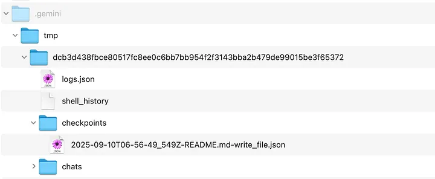
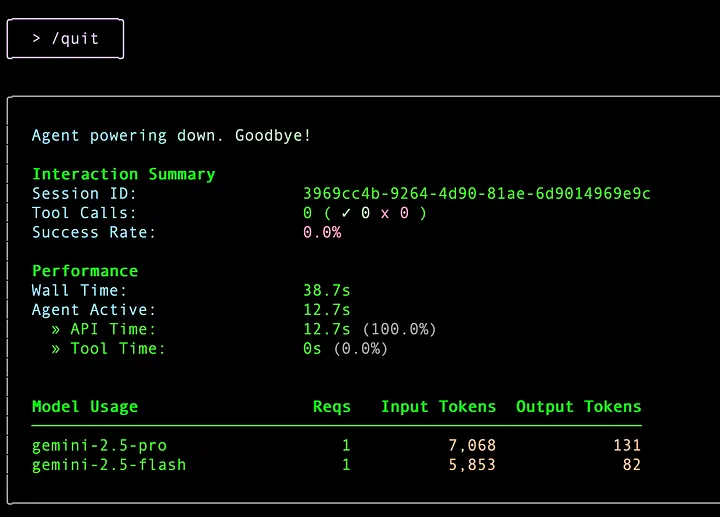

Let’s have a bit of fun first. Check out the -y option, which is the YOLO mode. Ideally you may not want to run Gemini CLI in this fashion, since it will automatically accept all actions. Actions like we saw in the first part, could be things like writing to files, etc — which you might want to acknowledge and permit. But this is not the fun part. The fun part is how the Gemini CLI Engineers have provided a super useful link in the above help instructions for --yolo mode. It has a URL, a Youtube video in fact, for you to see the details on this wonderful feature. Please go to that URL and come back with your responses to that

### Which version of Gemini CLI are you running?
Let’s get back to the options. The -v or --version is straightforward and we did check that out in the first part. Currently, at the time of writing, here is my Gemini CLI version.
```bash
gemini -v
0.4.0
```
* So, if you are an older version, go ahead and do that upgrade, the instruction is repeated below:
```bash
npm upgrade -g @google/gemini-cli
```

### Specifying a Gemini model for the Gemini CLI to use
Currently, I know of 2 models that one can specify to the Gemini CLI while starting up: gemini-pro-2.5 and gemini-flash-2.5. This is specified via the -m or--modelparameter as shown below
```bash
gemini -m "gemini-flash-2.5"
```

### One prompt at a time
While this is good, here is what I have seen happen and its understandable in the free tier. If you are using the free tier of Gemini CLI with your personal Google account, you will find that even if you choose the gemini-2.5-pro model, the CLI adjusts to the gemini-2.5-flash model due to quota issues. So be prepared for that. This can be addressed to the best of my knowledge by switching over to using your own Gemini API Key. You might see a debug message that looks like this:


How about executing Gemini CLI in a way that it does not bring up the terminal interface. Instead, it just takes your prompt, executes it and gives back the result. This is known as the non-interactive mode.

This can be very useful in scenarios where you want to integrate Gemini CLI in automated pipelines or schedule something at a specific time, without the need for any human interface. This is flexibility of the Gemini CLI interface where its not just about running something inside of a terminal but can be integrated in various other scenarios and execution modes too.

So coming back to what we wanted to try? In case you have a need to simply prompt the Gemini CLI and do not require the terminal interface to come up, try the -p or the --prompt option, as shown below:

```bash
gemini -p "What is the gcloud command to deploy an application to Google Cloud Run"

or

gemini -p "What is the command line syntax for doing a GET call to myhost.com via curl"

```

### Positional Prompt instead of prompt parameter
From what I understand at the time of writing (v0.4.0), this is being deprecated in favour of positional prompt. This means that we can simply give the prompt words after gemini.

```bash
gemini "What is the gcloud command to deploy an application to Google Cloud Run"

or

gemini "What is the command line syntax for doing a GET call to myhost.com via curl"
```

### d stands for debug
You might not need this option ideally but in case you are reporting an issue or even to understand a bit about what is going on, its helpful to see what happens when we use the debug flag i.e. -d or --debug

First, let me show you the -d option while a single prompt (using -p) at the command line. Before I go into launching the Gemini CLI and its output, let me describe the current folder that I am in and its contents. This is important for you too.

I am launching Gemini CLI from /Users/romin/gemini-cli-projectsfolder. This folders has several folders, which contain apps that I have generated using Gemini CLI itself.

```bash
gemini -d -p "What is the Linux command to move files recursively from one folder to another. Give me an example or two"
```

This results in the following output. I have truncated some of the file listings, so that we keep the focus on what is going on. A better understanding of this output is critical so that you can understand the hierarchy in which Gemini CLI looks at certain files to load in order to setup the context (hint : GEMINI.md)

```bash
[DEBUG] [MemoryDiscovery] Loading server hierarchical memory for CWD: /Users/romin/gemini-cli-projects/cli-series (importFormat: tree)
[DEBUG] [MemoryDiscovery] Searching for GEMINI.md starting from CWD: /Users/romin/gemini-cli-projects/cli-series
[DEBUG] [MemoryDiscovery] Determined project root: None
[DEBUG] [BfsFileSearch] Scanning [1/200]: batch of 1
[DEBUG] [BfsFileSearch] Scanning [3/200]: batch of 2
[DEBUG] [BfsFileSearch] Scanning [6/200]: batch of 3
[DEBUG] [BfsFileSearch] Scanning [8/200]: batch of 2
[DEBUG] [BfsFileSearch] Scanning [9/200]: batch of 1
[DEBUG] [BfsFileSearch] Scanning [24/200]: batch of 15
[DEBUG] [BfsFileSearch] Scanning [39/200]: batch of 15
[DEBUG] [BfsFileSearch] Scanning [54/200]: batch of 15
[DEBUG] [BfsFileSearch] Scanning [69/200]: batch of 15
[DEBUG] [BfsFileSearch] Scanning [84/200]: batch of 15
[DEBUG] [BfsFileSearch] Scanning [99/200]: batch of 15
[DEBUG] [BfsFileSearch] Scanning [114/200]: batch of 15
[DEBUG] [BfsFileSearch] Scanning [129/200]: batch of 15
[DEBUG] [BfsFileSearch] Scanning [144/200]: batch of 15
[DEBUG] [BfsFileSearch] Scanning [159/200]: batch of 15
[DEBUG] [BfsFileSearch] Scanning [174/200]: batch of 15
[DEBUG] [BfsFileSearch] Scanning [189/200]: batch of 15
[DEBUG] [BfsFileSearch] Scanning [196/200]: batch of 7
[DEBUG] [BfsFileSearch] Scanning [198/200]: batch of 2
[DEBUG] [MemoryDiscovery] Final ordered GEMINI.md paths to read: []
[DEBUG] [MemoryDiscovery] No GEMINI.md files found in hierarchy of the workspace.
Flushing log events to Clearcut.
Session ID: d8955cf4-64d7-46b7-a50c-b89b5aaaeb9e
```

You will notice that the Gemini CLI starts building up a context and tries to find the GEMINI.md file. It keeps looking recursively till it has reached the root. At the moment, I do not have any GEMINI.md file and hence it could not find that. But if it did, it would have found all the GEMINI.md files and concatenated them to create, as the documentation states “instructional context (also referred to as “memory”) provided to the Gemini model. This powerful feature allows you to give project-specific instructions, coding style guides, or any relevant background information to the AI, making its responses more tailored and accurate to your needs”.

We will get to the GEMINI.md file a bit later, but here are a couple of things that I believe you should understand if using the Gemini CLI tool.

### What is GEMINI.md and why do I need it?
Let’s relook at the high level information around GEMINI.md as mentioned in the documentation over here. Its actually quite well written and hence I do not wish to recreate it in some other way. I have highlighted key things in bold.

While not strictly configuration for the CLI’s behavior, context files (defaulting to GEMINI.md but configurable via the context.fileName setting) are crucial for configuring the instructional context (also referred to as "memory") provided to the Gemini model. This powerful feature allows you to give project-specific instructions, coding style guides, or any relevant background information to the AI, making its responses more tailored and accurate to your needs. The CLI includes UI elements, such as an indicator in the footer showing the number of loaded context files, to keep you informed about the active context.
 
Purpose: These Markdown files contain instructions, guidelines, or context that you want the Gemini model to be aware of during your interactions. The system is designed to manage this instructional context hierarchically.

There are a lot of articles that cover how best to write GEMINI.md files and it will continue to be something that keeps getting covered. For the moment, it is sufficient to understand that this is one of the key mechanisms by which we can instruct the Gemini CLI to follow our rules/recommendations in how code is generated, any versions, how dependencies should be managed, coding guidelines, etc. You get the gist of where this is going.

I reproduce again, a part of the documentation, that shows a sample GEMINI.md file for a Typescript project. Even if you are not a Typescript person, this is a good template to take, customize it for your preferences, language, frameworks and more.

---

At this point, if I do a /memory show command, I can see the current context, what files were loaded, etc. This is very useful to understand if the context was loaded correctly. While I do not have a GEMINI.mdfile at the moment, due to which there is nothing available as per the output below.

If you happen to have a GEMINI.md file, modify it outside, you can always refresh it via the /memory refresh command. Try that command right now and see the similar debug statements that come up.

Whew ! That was a lot of discussion just for debug. But do keep this option handy. In case you are reporting any specific issues that you find, it might be handy to turn on the debug mode and see what is going on.

### Let’s have a checkpoint
This is an interesting but an essential feature. Imagine you are going on with the Gemini CLI and it has used tools to write to file, etc. But something goes wrong and you would like to get back to the previous good state. That’s the checkpointing feature, which as the documentation states “automatically saves a snapshot of your project’s state before any file modifications are made by AI-powered tools. This allows you to safely experiment with and apply code changes, knowing you can instantly revert back to the state before the tool was run.”

By default, when you launch the Gemini CLI, checkpointing is not enabled and you will need to enable it via the -c or --checkpointing flag, when you launch it.

Let’s see this feature in action. First up, I have a small Go project. It is a command line utility that takes a sample text file and it provides the number of characters, words and lines in the text file. So I am in that current folder that has a main.go file and a sample file to test test.txt. This is also a Git enabled folder and I have committed main.go, test.txt and go.mod.

I launch Gemini CLI with the checkpointing and debugging enabled as given below:
```bash
gemini -c -d
```

The status bar clearly shows that I am in --debugmode and the folder along with the Git branch are shown.

* Let’s run a shell command via the ! to just validate a few things.
* So I have run two commands, the pwd and the ls command

At this point, there is nothing to restore or go back to. If you need to restore back to some point, you do that via the /restore command. If you just use the command as is, it says that there are no restorable tool calls found. And this is fair since we have not asked Gemini to do any task, that resulted in things like creating folders, writing files, etc.


If you now run the command /restore, you can see that there is a checkpoint that it is generated. As per the documentation “these file names are typically composed of a timestamp, the name of the file being modified, and the name of the tool that was about to be run (e.g., 2025–09–10T06–56–49_549Z-README.md-write_file).\

You can see that it has the timestamp-<filename>-<toolname>.
Before we make another change to the README.md file, let us see where the checkpoint data is being stored? Go to the home directory (e.g. ~ on my Mac). This will have a .gemini/tmp folder. Expand that to see a folder that will contain your logs, shell history and checkpoints. A sample for the above operations that we have done is shown below:



Remember that Checkpointing is not available by default, so you need to provide the checkpointing flag when you start the Gemini CLI or better still, if this is a feature that you absolutely want running all the time, then you can put that in the settings.json file, which we shall see in the next part of this series.

---

### Session summary
If you are looking for your session summary to be persisted, which you can then look into, you can try the--session-summary parameter.

Launch it as follows: gemini --session-summary "session.txt"

This will launch Gemini CLI and keep a track of the. A sample run for my project folder and a couple of interactions to get the list of files and to get an explanation for a file is shown below:

```bash
{
  "sessionMetrics": {
    "models": {
      "gemini-2.5-pro": {
        "api": {
          "totalRequests": 1,
          "totalErrors": 0,
          "totalLatencyMs": 9119
        },
        "tokens": {
          "prompt": 7068,
          "candidates": 131,
          "total": 7816,
          "cached": 0,
          "thoughts": 617,
          "tool": 0
        }
      },
      "gemini-2.5-flash": {
        "api": {
          "totalRequests": 1,
          "totalErrors": 0,
          "totalLatencyMs": 3589
        },
        "tokens": {
          "prompt": 5853,
          "candidates": 82,
          "total": 6009,
          "cached": 0,
          "thoughts": 74,
          "tool": 0
        }
      }
    },
    "tools": {
      "totalCalls": 0,
      "totalSuccess": 0,
      "totalFail": 0,
      "totalDurationMs": 0,
      "totalDecisions": {
        "accept": 0,
        "reject": 0,
        "modify": 0,
        "auto_accept": 0
      },
      "byName": {}
    },
    "files": {
      "totalLinesAdded": 0,
      "totalLinesRemoved": 0
    }
  }
}
```
It provides you information on the model used, the calls based, the tokens used and more. You could possibly use these metrics, aggregate in a central place for your own analysis.

The data in session.txt file is similar to the one that you get on stats command inside of Gemini CLI. Alternately, if you /quit Gemini CLI, you get a summary too, that looks similar. A sample summary shown when I quit the above session is shown below.
<br>



