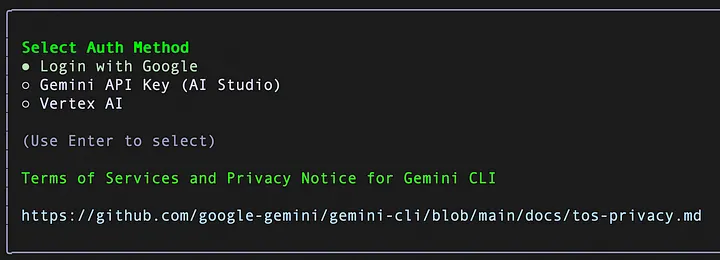

**Installation**
```bash
npm install -g @google/gemini-cli
```

**Once done, I suggest that you check the Gemini CLI version as follows:**
```bash
gemini -v
```

Go ahead and launch Gemini CLI via the gemini command. Keep in mind that this is a client running in your terminal, so be comfortable with using the keyboard (Arrow keys, etc).

It would first ask you about choosing a theme. Go ahead and select one that you like:

---

Go with the Google login, which will provide you access to the free tier of Gemini CLI, which allows for 60 requests/minute, 1000 model requests per day. This will invoke the browser, where you will need to login with your Google credentials for the account that you wish to use here. Once done, you should see `Gemini CLI` waiting for your command

---
Alternately, if you need higher quota, feel free to provide your Gemini API Key or even Vertex AI, where you may have a Google Cloud Project with billing enabled. Do refer to the Authentication section of the documentation.


### With Auth (connect with google account)
* first run this command
```bash
gemini
```



