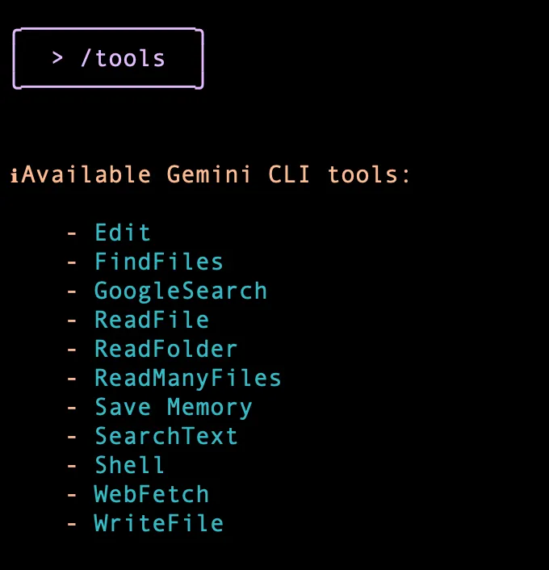
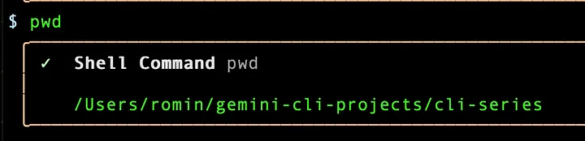

**Installation**
```bash
npm install -g @google/gemini-cli
```

**Once done, I suggest that you check the Gemini CLI version as follows:**
```bash
gemini -v
```

Go ahead and launch Gemini CLI via the gemini command. Keep in mind that this is a client running in your terminal, so be comfortable with using the keyboard (Arrow keys, etc).

It would first ask you about choosing a theme. Go ahead and select one that you like:

---

Go with the Google login, which will provide you access to the free tier of Gemini CLI, which allows for 60 requests/minute, 1000 model requests per day. This will invoke the browser, where you will need to login with your Google credentials for the account that you wish to use here. Once done, you should see `Gemini CLI` waiting for your command

---
Alternately, if you need higher quota, feel free to provide your Gemini API Key or even Vertex AI, where you may have a Google Cloud Project with billing enabled. Do refer to the Authentication section of the documentation.


### With Auth (connect with google account)
* first run this command

```bash
gemini
```


---

**check all command**
```bash
/help
```

#### Available Gemini CLI Tools


**It says shell mode enabled and I am typing the pwd command to understand where I am. The output is shown as below:**

You can come out of the terminal mode, by hitting ESC key.

You can quit Gemini CLI via the /quit command and then ensure that you are in the folder that you would like to be and then launch gemini from there.


#### model sweetch
```bash
genimi --model genini-2.5-flash

or

genimi --m genini-2.5-flash
```

#### Shell mode enabled
```bash
! --> esc to disable
```

### Simple Project with Agent Call

```bash
1-> mkdir cli_session
2-> gemini --model gemini-2.5-flash
3-> create a project with python and uv to build a simple calculator (agent command)
```


#### Permission Always Allow (Yolo Mode)
```bash
gemini --model gemini-2.5-flash --yolo

or 

gemini --model gemini-2.5-flash --y

or 

Ctrl C (shortcut command) 
```
* koe bhi kam krega agent  ko kisi point pr permission nh mangyga.


#### File open in terminal
* goto shell mode (!) and run this
```bash 
cat kids.md
```

#### Debug
```bash
gemini --model gemini-2.5-flash debug
```

**Run Command**
* you can check model and tools stats
```bash
/ stats
```


