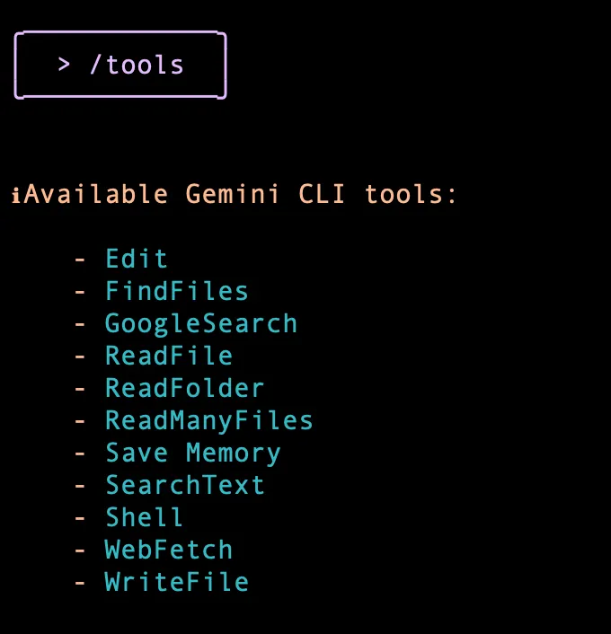

# Gemini CLI Tutorial Series — Part 4 : Built-in Tools
Gemini CLI comes with a set of built-in tools and as the documentation states “Gemini model uses this tools to interact with your local environment, access information, and perform actions. These tools enhance the CLI’s capabilities, enabling it to go beyond text generation and assist with a wide range of tasks.”

When it comes to local environment, these are your local file folders, files in them. So for e.g. if you ask Gemini CLI to write code and save that file, it will need to interact with the local file system, current folder and create the file with the contents. If you provide a local folder and ask Gemini to examine the contents of all the files in that folder, then it will need tools to read the folder contents, read each file content and so on.

Its not just about the local environment but there are a few built-in tools that can access the internet, do Google Search based on your query, fetch the contents of a url and so on. Imagine you giving a prompt that says “Fetch the news from xyz site and summarize it for me”.

To get a list of current Built-in Tools, we need to simply invoke the /toolscommand as shown below:

