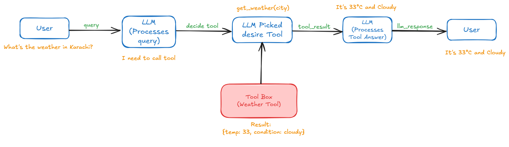

# Tools
Tools let agents take actions: things like fetching data, running code, calling external APIs, and even using a computer. There are three classes of tools in the Agent SDK:

* Hosted tools: these run on LLM servers alongside the AI models. OpenAI offers retrieval, web search and computer use as hosted tools.
* Function calling: these allow you to use any Python function as a tool.
* Agents as tools: this allows you to use an agent as a tool, allowing Agents to call other agents without handing off to them.


### Hosted tools
1. The WebSearchTool lets an agent search the web.
2. The FileSearchTool allows retrieving information from your OpenAI Vector Stores.
3. The ComputerTool allows automating computer use tasks.
4. The CodeInterpreterTool lets the LLM execute code in a sandboxed environment.
5. The HostedMCPTool exposes a remote MCP server's tools to the model.
6. The ImageGenerationTool generates images from a prompt.
7. The LocalShellTool runs shell commands on your machine.


### Visual Representation


---


### Tools Class
```bash
(variable) tools: list[FunctionTool | FileSearchTool | WebSearchTool | ComputerTool | HostedMCPTool | LocalShellTool | ImageGenerationTool | CodeInterpreterTool]
```

### Function tools / Function calling
You can use any Python function as a tool. The Agents SDK will setup the tool automatically:

* The name of the tool will be the name of the Python function (or you can provide a name)
* Tool description will be taken from the docstring of the function (or you can provide a description)
* The schema for the function inputs is automatically created from the function's arguments
* Descriptions for each input are taken from the docstring of the function, unless disabled

```bash
@function_tool
def get_weather(city: str) -> str:
    
    """Get the current Weather of Karachi"""
    return f"{input},Weather is summy"


my_agent =  Agent(
    name="Assistance",
    instructions="you are a helpfull assistance, if your acked weather related question you want to call get_weather Tool",
    tools=[get_weather]
)
```

* agr me tool me doc string nh dunga to tool me jab bhi proper work kryga.
* llm ke pass function signature def get_weather(city: str) -> str: or function body jati.
* @function_tool function signature or dot string ki help sy fucntion schema banata ha or llm us function shemea ko he read krta ha

#### async Tool 
```bash
@function_tool
async def get_weather(city: str) -> str:
    return f"The weather in {city} is sunny."
```   

##### @function_tool Class
```bash
(function)
def function_tool(
    func: ToolFunction[...],
    *,
    name_override: str | None = None,
    description_override: str | None = None,
    docstring_style: DocstringStyle | None = None,
    use_docstring_info: bool = True,
    failure_error_function: ToolErrorFunction | None = None,
    strict_mode: bool = True,
    is_enabled: bool | ((RunContextWrapper[Any], Agent[Any]) -> MaybeAwaitable[bool]) = True
) -> FunctionTool: ...

def function_tool(
    *,
    name_override: str | None = None,
    description_override: str | None = None,
    docstring_style: DocstringStyle | None = None,
    use_docstring_info: bool = True,
    failure_error_function: ToolErrorFunction | None = None,
    strict_mode: bool = True,
    is_enabled: bool | ((RunContextWrapper[Any], Agent[Any]) -> MaybeAwaitable[bool]) = True
) -> ((ToolFunction[...]) -> FunctionTool): ...
```

## Agent as a Tool
```bash

# Define a support agent
poetry_agent = Agent(
    name="Poetry Writer Agent",
    instructions="Write a 3-stanza English poem on the given topic.",
    model=model
)

# Convert agents into tools
poetry_tool = poetry_agent.as_tool(
    tool_name="english_poetry_writer_tool",
    tool_description="Writes English poetry on the given topic."
)

triage_agent = Agent(
    name="Triage Agent",
    instructions="""
You are a smart assistant.
1. If the user asks for a poem or poetry, use 'english_poetry_writer_tool'.
2. Otherwise, use 'english_essay_writer_tool'.
Never write content yourself. Always call the right tool.
""",
    tools=[poetry_tool],
    model=model
)
```

### as_tools() Class
```bash
(method) def as_tool(
    tool_name: str | None,
    tool_description: str | None,
    custom_output_extractor: ((RunResult) -> Awaitable[str]) | None = None
) -> Tool
```

#### Complete Code Example Agent As a Tool
```bash
from agents import Agent, Runner

# Define individual agents
shopping_agent = Agent(
    name="Shopping Assistant",
    instructions="You assist users in finding products and making purchase decisions."
)

support_agent = Agent(
    name="Support Agent",
    instructions="You help users with post-purchase support and returns."
)

# Convert agents into tools
shopping_tool = shopping_agent.as_tool()
support_tool = support_agent.as_tool()

# Define a triage agent that delegates tasks
triage_agent = Agent(
    name="Triage Agent",
    instructions="You route user queries to the appropriate department.",
    tools=[shopping_tool, support_tool]
)

# Run the triage agent with a sample input
result = Runner.run_sync(triage_agent, "I need help with a recent purchase.")
print(result.final_output)
```

#### Customizing tool-agents
```bash
from agents import Agent, Runner, function_tool

@function_tool
async def run_my_agent(input: str) -> str:
    """Runs a sub-agent with custom config and input."""

    agent = Agent(
        name="My Agent",
        instructions="You help users by translating text to French."
    )

    result = await Runner.run(
        agent,
        input=input,
        max_turns=5 # max_turns = 5 ka matlab hai ke agent sirf 5 dafa LLM call karega ya tools use karega jab tak final output produce ho.
    )

    return str(result.final_output)
```

### Custom function tools
Sometimes, you don't want to use a Python function as a tool. You can directly create a FunctionTool if you prefer. You'll need to provide:
* name
* description
* params_json_schema, which is the JSON schema for the arguments
* on_invoke_tool, which is an async function that receives a ToolContext and the arguments as a JSON string, and must return the tool output as a string.


#### 1. Handoff vs As Tool
The key difference here revolves around what context is passed to the new agent and how control of the conversation flows between agents. Let’s break down each point:

* Handoffs:
When an agent uses a handoff, the new (receiving) agent is given the entire conversation history. This means that it gets every message—user input, previous responses, tool calls, and any context that has been built up so far. This comprehensive context allows the new agent to fully understand the background, nuances, and prior decisions of the conversation. It’s as if the conversation “moves” entirely over to the new agent, which can then generate responses based on all of the earlier dialogue.

* Tool-based Calls (using as_tool):
In contrast, when an agent is invoked as a tool (using the as_tool method), it does not receive the whole conversation history. Instead, it gets a piece of generated input from the original agent—often a specific string or a data payload that was produced during the conversation. The new agent (now acting as a tool) only processes this discrete input. This design is useful when the new agent’s functionality is meant to handle a specific task or computation without needing the full background, thereby keeping the interface simpler and more focused.

#### 2. . Flow of Conversation Control
* Handoffs:
In a handoff, the new agent “takes over” the conversation. Because it receives the full history, it continues the interaction as if it were the main agent, making decisions, asking follow-up questions, or generating responses based solely on the transferred dialogue. Essentially, the conversational control is completely passed to the new agent, which now becomes responsible for driving the dialogue forward.

* Tool-based Calls (using as_tool):
When an agent is used as a tool, it is invoked by the original agent to perform a specific function (for example, processing data or executing a sub-task). After the tool (the new agent) completes its job and returns its output, the original agent resumes the conversation. The original agent integrates the tool’s result into the ongoing dialogue, which means it maintains overall control of the conversation flow. This approach allows for modularity—different agents can be “plugged in” to perform functions without completely transferring the conversational context or control.


#### 3. Why This Distinction Matters
* Modularity and Reusability:
Using the tool method (via as_tool) is ideal for building systems where you want to keep the conversation centralized. The original agent can call upon various specialized sub-agents (tools) for tasks like calculations, look-ups, or processing requests, then stitch their outputs back into a coherent conversation. This leads to a highly modular design where each agent can be developed and maintained independently while still contributing to a unified interaction.

* Context-Rich Delegation:
Handoffs, on the other hand, are best suited for scenarios where the new agent must have a complete understanding of the conversation to address complex or nuanced issues. This might be important in customer support or when the conversation’s history carries essential details that affect subsequent responses.


#### An Analogy
Imagine you’re at a restaurant:

* Handoff: If you ask the host to call the chef over because your dish needs a complete rework, the chef comes over with full knowledge of everything that’s happened (the conversation history, complaints, previous interactions) and takes over your service.
* Tool Call: Instead, if you ask the waiter to bring a side dish, the waiter simply takes your specific request (the generated input) and returns with the dish. You, as the diner, still engage directly with the waiter, who integrates that dish into your meal.


# Web Search Tool 

